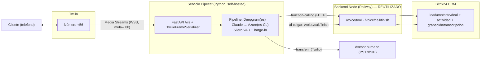
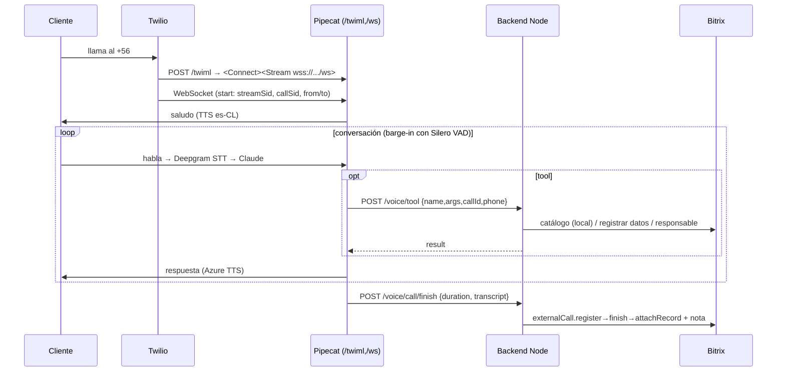

# Fase 2 (self-hosted) — Agente de Voz con Pipecat + Twilio + Bitrix24

> Universidad Autónoma de Chile · Postgrados · v1.0 (2026-07-04)
> Fundamentado en documentación y ejemplos OFICIALES de Pipecat, Twilio y Bitrix24 (ver §14). Lo no confirmado se marca **[POR VERIFICAR]**.

---

## 0. Resumen y decisión

Agente de voz **propio (self-hosted)**: nosotros corremos el servicio de tiempo real. Elegido tras confirmar 4 motivaciones: **costo a escala, control/datos, latencia y capacidad interna**. Motor: **Pipecat** (framework open-source que resuelve turn-taking/barge-in y encadena STT→LLM→TTS). Telefonía: **Twilio** (número +56). Cerebro: **Claude**. Reutiliza el catálogo y CRM del bot actual vía HTTP a nuestro backend Node.

| Componente | Elección |
|---|---|
| Orquestación | **Pipecat** (Python, FastAPI + WebSocket) |
| Telefonía | **Twilio** Media Streams (`<Connect><Stream>`, mulaw 8 kHz) |
| STT | **Deepgram** (`language="es"`) |
| LLM | **Claude** (`AnthropicLLMService`, Haiku por latencia) |
| TTS | **Azure** `es-CL-CatalinaNeural` (o Cartesia/ElevenLabs) |
| VAD / barge-in | **Silero VAD** + `allow_interruptions=True` |
| Catálogo + CRM | Reutilizados: function-calling → **backend Node** (`/voice/tool`, `/voice/call/finish`) |

**Qué construimos nuevo:** solo el servicio de voz en tiempo real (`voice-pipecat/`). Todo lo demás (Claude, catálogo 184 programas, CRM, responsable, registro `telephony.externalCall.*`) **ya existe y se reutiliza**.

---

## 1. Topología

Entre Pipecat y el backend Node viaja **solo JSON** (herramientas + fin de llamada). El audio se procesa dentro de Pipecat (control total, sin terceros de orquestación).

---

## 2. Componentes

### 2.1 Servicio Pipecat — [`voice-pipecat/`](voice-pipecat/)
- `server.py`: FastAPI con `/twiml` (devuelve `<Connect><Stream>`), `/ws` (audio Twilio → `run_bot`), `/dialout` (saliente).
- `bot.py`: pipeline `transport.input() → Deepgram → context.user() → Claude → Azure TTS → transport.output() → context.assistant()`; Silero VAD + `allow_interruptions`; 4 tools que hacen HTTP a `/voice/tool`; al colgar postea a `/voice/call/finish`.

### 2.2 Backend Node (reutilizado) — en el repo
- `POST /voice/tool` (`src/routes/voiceApi.ts`): ejecuta `consultar_programas`/`detalle_programa`/`registrar_interes_crm`/`transferir_a_asesor` con la MISMA lógica del bot (`runVapiTool` + catálogo + CRM + responsable).
- `POST /voice/call/finish`: registra la llamada en Bitrix (`telephony.externalCall.register→finish→attachRecord` + nota de transcripción).
- Ambos protegidos con `x-voice-secret` (= `VAPI_SECRET`).

### 2.3 Twilio y Bitrix
- Twilio: número +56, `<Connect><Stream>` bidireccional (mulaw 8 kHz).
- Bitrix: recibe la llamada como actividad + lead/contacto + grabación/transcripción.

---

## 3. Flujos

### 3.1 Entrante

### 3.2 Saliente
`POST /dialout {to_number}` → `twilio.calls.create(to, from_, url=/twiml)` → Twilio abre el stream contra `/ws` → mismo pipeline. (Recuerda la norma chilena **+56600/+56809** para salientes automatizadas masivas.)

---

## 4. Pipeline y barge-in (Pipecat)

- **Cadena:** `transport.input() → DeepgramSTTService(language="es") → context_aggregator.user() → AnthropicLLMService → AzureTTSService → transport.output() → context_aggregator.assistant()`.
- **Contexto:** `OpenAILLMContext([system], tools=ToolsSchema(...))` + `llm.create_context_aggregator(context)`.
- **Barge-in:** `SileroVADAnalyzer` (en `FastAPIWebsocketParams`) + `PipelineParams(allow_interruptions=True)`. Cuando el VAD detecta que el cliente habla, Pipecat **corta el TTS** y descarta lo pendiente (conversación natural, sin esperar a que el bot termine).
- **Audio:** `audio_in_sample_rate=8000`, `audio_out_sample_rate=8000`, `add_wav_header=False` (Twilio = mulaw 8 kHz).
- **Saludo primero:** al `on_client_connected` se encola `LLMRunFrame()` y el system prompt instruye saludar.

> **[POR VERIFICAR] versión de Pipecat:** la API está en transición (clásico `PipelineTask`/`PipelineRunner`/`OpenAILLMContext` vs nuevo `PipelineWorker`/`WorkerRunner`/`LLMContext`; y dónde va exactamente `vad_analyzer`). El esqueleto usa el patrón clásico. **Fija una versión** de `pipecat-ai` y alinéate a ella; compara con el ejemplo oficial `pipecat-ai/pipecat-examples/twilio-chatbot`.

---

## 5. Herramientas (function-calling → nuestro backend)

En `bot.py` se definen 4 `FunctionSchema` y se registran con `llm.register_function`. El handler hace `aiohttp.post(/voice/tool)` y devuelve el resultado con `params.result_callback`. Ventaja clave: **el catálogo se resuelve con lookup exacto** en nuestro backend (precios 100% correctos, sin el riesgo del RAG) y **rápido** (misma infra). CRM y responsable idénticos al chat.

---

## 6. Registro en el CRM

Al colgar, `bot.py` postea a `/voice/call/finish` con `duration` + `transcript`; el backend hace `telephony.externalCall.register` (crea/vincula lead/contacto), `finish` (actividad + duración) y adjunta la transcripción. Requiere app OAuth con scope **`telephony`** (igual que la vía Vapi) — NO webhook.

---

## 7. Twilio (telefonía)

- **TwiML** (entrante y saliente): `<Response><Connect><Stream url="wss://<host>/ws"/></Connect></Response>`. Bidireccional: Twilio no ejecuta más TwiML hasta que el WS cierra.
- **Serializer:** `TwilioFrameSerializer(stream_sid, call_sid, account_sid, auth_token)`; `parse_telephony_websocket` extrae `streamSid`/`callSid`/`customParameters` del primer mensaje `start`.
- **Saliente:** `client.calls.create(to, from_, url=".../twiml")`.
- **Número +56:** mismo requisito que la vía Vapi (Regulatory Bundle de la UA; prefijos +56600/+56809 para salientes automatizadas).

---

## 8. Español (es-CL)
- STT: Deepgram `language="es"` (**[POR VERIFICAR]** `es-419` como string).
- TTS: Azure `es-CL-CatalinaNeural`/`LorenzoNeural` (**[POR VERIFICAR]** nombre exacto en la galería de Azure Speech). Alternativas de baja latencia: Cartesia; o ElevenLabs Flash v2.5 (voz latina).

---

## 9. Costos (orden de magnitud, a validar)
Pagas cada componente **a costo**, sin fee de plataforma (a diferencia de Vapi ~$0.05/min):
Twilio (voz +56) + Deepgram (STT) + Anthropic (Claude Haiku) + Azure/Cartesia (TTS) + hosting del servicio. A volumen (18k leads/mes) suele salir **más barato/min que Vapi**, a cambio de **ingeniería y operación** propias.

---

## 10. Despliegue y operación (honesto)
- Servicio **Python FastAPI** (uvicorn) en un host con **WebSocket** (Railway/Fly). **Una sesión/pipeline por llamada** → dimensionar CPU/concurrencia.
- Es **tiempo real 24/7**: hay que monitorear latencia, caídas de WS, reconexión, buzón de voz, y tener alertas. Más exigente que el bot HTTP.
- Silero VAD corre local (CPU). Deepgram/Azure/Anthropic son API externas (latencia de red).

---

## 11. Riesgos / [POR VERIFICAR]
1. **Versión/API de Pipecat** en transición → fijar versión y alinear el código (clásico vs `PipelineWorker`).
2. **Número +56 en Twilio** (Regulatory Bundle) — mismo pendiente que Vapi; es el gate.
3. **Nombre de voz es-CL en Azure** y `es-419` en Deepgram → confirmar en runtime.
4. **Operación 24/7** → definir quién mantiene el servicio.
5. **Concurrencia/escala** → pruebas de carga antes de producción.

---

## 12. Plan de PoC por hitos
| Hito | Entregable | Aceptación |
|---|---|---|
| **P0** | Cuentas/keys (Twilio +56, Deepgram, Azure, Anthropic) | listas |
| **P1** | `voice-pipecat` corre local + ngrok; eco de voz | contesta y transcribe es-CL |
| **P2** | Claude + tools → `/voice/tool` | responde de programas/precios (exacto) |
| **P3** | barge-in + latencia | interrumpible; latencia objetivo <1s |
| **P4** | `/voice/call/finish` → CRM | llamada + datos + transcripción en Bitrix |
| **P5** | `/dialout` saliente + deploy en Railway/Fly | llamada saliente end-to-end en la nube |

---

## 13. En el repositorio
- `voice-pipecat/` — servicio Pipecat (`server.py`, `bot.py`, `requirements.txt`, `env.example`, `README.md`).
- `src/routes/voiceApi.ts` — `/voice/tool` + `/voice/call/finish` (reusa catálogo/CRM/telephony).
- Reutilizados: `src/voice/vapiTools.ts` (dispatcher), `src/crm/telephony.ts`, catálogo y CRM.

Typecheck del backend Node OK. El servicio Python es un **esqueleto de referencia**: instalar deps, fijar versión de `pipecat-ai` y probar contra Twilio.

---

## 14. Fuentes
**Pipecat:** https://docs.pipecat.ai · quickstart, function-calling, speech-input · services: llm/anthropic, stt/deepgram, tts/azure|cartesia|elevenlabs, transport/fastapi-websocket · serializers/twilio · ejemplo `github.com/pipecat-ai/pipecat-examples` → `twilio-chatbot` (inbound/outbound) · `src/pipecat/runner/utils.py`, `src/pipecat/serializers/twilio.py`.
**Twilio:** https://www.twilio.com/docs/voice/twiml/stream · https://www.twilio.com/docs/voice/api/call-resource
**Bitrix24:** https://apidocs.bitrix24.com/api-reference/telephony/ (externalCall.register/finish/attachRecord/searchCrmEntities).
