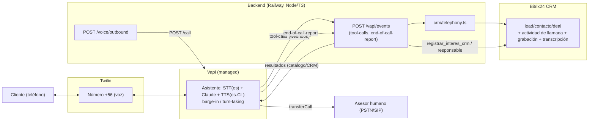
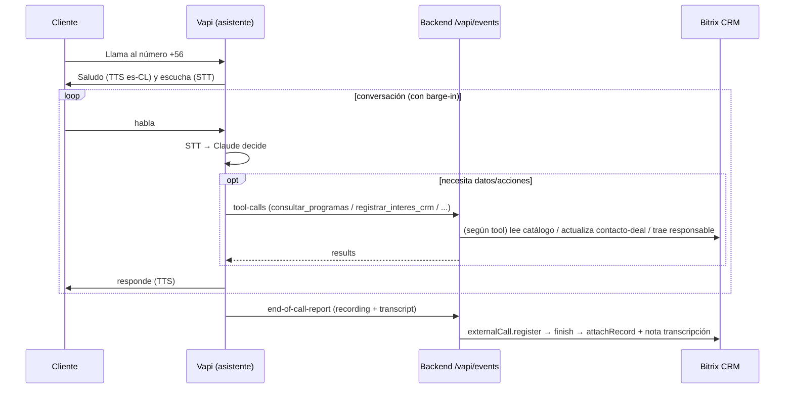

# Fase 2 — Agente de Voz Conversacional con IA (Vapi + Twilio + Bitrix24)

> Universidad Autónoma de Chile · Postgrados · v1.0 (2026-06-30)
> Fundamentado en documentación oficial de Vapi, Twilio y Bitrix24 (ver §15). Lo no confirmado se marca **[POR VERIFICAR]**.

---

## 0. Resumen y decisiones

Agente de voz **bidireccional** (entrante + saliente) donde **Vapi** ejecuta la conversación en tiempo real (STT + TTS + barge-in + turn-taking) con **Claude** de cerebro, invoca **nuestro backend** (Node/TS en Railway) para las herramientas (catálogo, CRM, responsable), y registramos cada llamada en el **CRM de Bitrix24** vía `telephony.externalCall.*`.

| Decisión | Elección |
|---|---|
| Plataforma de voz | **Vapi** (managed) |
| Cerebro | **Claude** (nativo en Vabi, `provider: anthropic`; Haiku por latencia — "equilibrado") |
| Telefonía / número | **Twilio** (número chileno **+56**) importado a Vapi (BYO) |
| STT | Deepgram español (`es`) |
| TTS | Azure Neural **es-CL** (`es-CL-CatalinaNeural`) — o ElevenLabs premium |
| Dirección | Entrante + Saliente |
| Registro en CRM | `telephony.externalCall.*` (app OAuth + scope `telephony`) |

**Por qué Vapi** (ver §1): resuelve la parte más difícil (audio en tiempo real, barge-in, turn-taking), soporta **Claude nativo**, llama a **nuestras herramientas por webhook** (reutilizamos catálogo/CRM/responsable ya hechos) y su outbound a Chile es flexible (usa el número Twilio).

---

## 1. Alternativas evaluadas

| Opción | Veredicto |
|---|---|
| **Telefonía integrada de Bitrix24** | ❌ Es Voximplant **gestionado/cerrado**: no permite escenarios de IA propios. (El usuario ya la tiene, pero no sirve para esto.) |
| **Voximplant standalone (VoxEngine)** | Viable, pero requería cuenta aparte + construir el escenario; sin ventaja de integración real. Descartada frente a Vapi. |
| **Twilio directo (bridge propio)** | Máximo control y menor costo/min, pero construir y mantener todo el stack de voz en tiempo real (WebSocket de audio mulaw, STT/TTS streaming, VAD/barge-in). Demasiado esfuerzo. |
| **Retell AI** | Muy similar a Vapi, con modelos Claude muy actuales; **pero Chile no aparece en su lista oficial de outbound internacional** → riesgo para llamadas salientes a +56. |
| **Vapi** ✅ | Managed, Claude nativo, tools por webhook, outbound flexible con nº Twilio. **Elegida.** |

**Hecho transversal:** el número **+56 sale de Twilio** en todos los caminos (Vapi/Retell no venden números de Chile). El trámite regulatorio chileno es el mismo (ver §9).

---

## 2. Topología



Solo viaja **texto/JSON** entre Vapi y nuestro backend (Vapi hace STT/TTS). Reutilizamos el mismo catálogo, integración CRM y "responsable del deal" del chat.

---

## 3. Componentes

### 3.1 Asistente Vapi — [`voice/vapi-assistant.json`](voice/vapi-assistant.json)
`model.provider=anthropic` (Claude), `transcriber=deepgram (es)`, `voice=azure es-CL`, `tools` (function) apuntando a nuestro `server.url`, y prompt de voz (frases cortas, sin URLs, flujo nombre→correo→teléfono).

### 3.2 Nuestro backend — en el repo
- `src/routes/vapi.ts`: `POST /vapi/events` (webhook único de Vapi) + `POST /voice/outbound` (dispara saliente).
- `src/voice/vapiTools.ts`: ejecuta cada tool call (`consultar_programas`, `detalle_programa`, `registrar_interes_crm`, `transferir_a_asesor`) reusando la lógica del chat; cachea el contexto CRM por `callId`.
- `src/crm/telephony.ts`: `searchCrmByPhone`, `registerCall`, `finishCall`, `attachCallRecord`.

### 3.3 Twilio
Provee el número **+56**; Vapi lo usa importado. Twilio soporta números locales/móviles chilenos con voz (ver §9).

### 3.4 Bitrix24
Recibe el registro de la llamada (actividad), lead/contacto creado/vinculado, grabación y transcripción.

---

## 4. Flujos

### 4.1 Entrante


### 4.2 Saliente
Disparador (score ≥ umbral o manual) → `POST /voice/outbound {phone}` → nuestro backend llama a **`POST https://api.vapi.ai/call`** con `assistantId` + `phoneNumberId` + `customer.number` → Vapi realiza la llamada por el número Twilio → mismo flujo. Para campañas, Vapi soporta `customers[]` / Outbound Campaigns.

---

## 5. Herramientas (tool-calls)

Vapi envía a `POST /vapi/events` un mensaje `type:"tool-calls"` con la lista de funciones que el modelo decidió invocar. Respondemos:
```json
{ "results": [ { "toolCallId": "<id>", "result": "<string>" } ] }
```
Mapeo (en `vapiTools.ts`):
- `consultar_programas` → `buscarProgramas` (top 5 para voz).
- `detalle_programa` → `getDetalle` (arancel/matrícula/requisitos/descripción).
- `registrar_interes_crm` → `actualizarDatosCliente` sobre la entidad CRM resuelta por teléfono.
- `transferir_a_asesor` → resuelve el **responsable del deal** (`getDealAsesores`) y devuelve `{asesor, destino}`.

El contexto CRM de la llamada se resuelve **una vez** por `callId` (`searchCrmByPhone`) y se cachea en KV.

---

## 6. Registro en el CRM de Bitrix24

Al `end-of-call-report`: `telephony.externalCall.register` (crea/vincula lead/contacto, `CRM_CREATE=1`) → `finish` (actividad + duración) → `attachRecord` (grabación de Vapi por URL) → nota con la transcripción en el timeline.

> ⚠️ **Confirmado:** `telephony.externalCall.*` **solo funciona con token de APLICACIÓN OAuth** y **scope `telephony`** ("works only in the context of an application"). **No** sirve webhook entrante. → Añadir `telephony` a la app y reinstalarla; el backend usa `callBitrix` (token del app).

---

## 7. Español (es-CL)

- **STT:** Deepgram con `language: es` (rápido, multilingüe). Alternativas: Google, Gladia.
- **TTS:** Azure Neural **`es-CL-CatalinaNeural`/`es-CL-LorenzoNeural`** (voces chilenas nativas) o ElevenLabs multilingüe para máxima naturalidad.
- **[POR VERIFICAR]** La doc de Vapi no lista explícitamente es-CL; confirmar la voz es-CL en el Voice Library del dashboard de Vapi al configurar el asistente.

---

## 8. Derivación a un humano

`transferir_a_asesor` devuelve el **responsable del deal** (`ASSIGNED_BY_ID`, ya implementado) o el fallback `VOICE_TRANSFER_FALLBACK`. La transferencia en vivo se hace con la función de **Call Transfer** de Vapi (`transferCall`) hacia el número/SIP del asesor. **[POR VERIFICAR]** el mecanismo exacto de destino **dinámico** (por llamada) en Vapi; alternativa robusta: un destino de transferencia fijo (línea comercial/hunt group) configurado en el asistente.

---

## 9. Números de Chile y regulación (el punto crítico)

- **Twilio ofrece números locales/móviles chilenos con voz** (entrante y saliente). Precio referencial: nº local ~US$7/mes; entrante ~US$0.011/min; saliente a móvil ~US$0.075/min **[precios a confirmar en el panel]**.
- **Requisitos regulatorios (obligatorios):** dirección en Chile + documento de identidad/empresa (extracto de registro de comercio). La **UA los cumple**.
- **Automatizadas salientes (ago-2025):** requieren prefijos **+56600** (deseadas) o **+56809** (no deseadas). Relevante para las llamadas salientes del bot. **[POR VERIFICAR]** disponibilidad de esos prefijos en Twilio.
- **[POR VERIFICAR] stock real** de números +56 en Twilio (Console → Buy a Number, país=Chile, capacidad=Voice) — es el mayor riesgo de viabilidad. Alternativa: número de otro país (peor conversión) o troncal SIP de un carrier chileno.

---

## 10. Latencia y costos (órdenes de magnitud)

- **Latencia:** Vapi está optimizado para conversación en tiempo real (barge-in/turn-taking incluidos); Haiku ayuda a respuestas rápidas.
- **Costo/min (aprox., a validar):** **Vapi ~US$0.05/min** de plataforma + proveedores (STT/LLM/TTS) a costo (o $0 en el fee de Vapi si traes tus API keys) + **telefonía Twilio** aparte. Con 18k leads/mes, usar la voz en segmentos de alto valor / fuera de horario y medir minutos reales en el PoC.

---

## 11. Seguridad y cumplimiento

- **`x-vapi-secret`:** Vapi firma el webhook con `server.secret`; el backend valida (`VAPI_SECRET`).
- **Consentimiento/grabación:** anunciar al inicio que es un asistente virtual y que la llamada puede grabarse (normativa de datos de Chile).
- **Datos:** el audio/transcripción pasa por Vapi/Twilio; evaluar retención (Vapi Build guarda historial 14 días; add-ons ZDR si se requiere). Claves en variables de entorno.
- **Token:** scope `telephony` en la app; el resto del CRM sigue por el webhook admin donde aplica.

---

## 12. Riesgos / [POR VERIFICAR]
1. **Disponibilidad de números +56 en Twilio** y prefijos +56600/+56809 para salientes automatizadas (mayor riesgo).
2. **Voz es-CL en Vapi** (confirmar en el dashboard).
3. **Transferencia dinámica** al asesor en Vapi (destino por llamada).
4. **Precios** exactos (Twilio + Vapi + proveedores) al momento de contratar.
5. Facturación de Claude: nativo en Vapi (a costo) vs. traer tu propia API key.

---

## 13. Plan de PoC por hitos

| Hito | Entregable | Aceptación |
|---|---|---|
| **V0 — Números** | Twilio + nº +56 con bundle regulatorio | Número que timbra y permite voz. |
| **V1 — Vapi base** | Asistente Vapi + nº importado + webhook | Contesta y conversa en es-CL. |
| **V2 — Cerebro+tools** | `/vapi/events` con catálogo | Responde de programas/precios usando nuestras tools. |
| **V3 — CRM** | end-of-call-report → externalCall.* + `registrar_interes_crm` | Llamada + datos quedan en el CRM. |
| **V4 — Derivación** | `transferir_a_asesor` → transferCall al responsable | Transfiere al asesor asignado. |
| **V5 — Saliente** | `/voice/outbound` desde score alto | La IA llama a un lead caliente. |

Prerrequisitos del usuario: cuenta Twilio (+ nº +56), cuenta Vapi (asistente + import nº), scope `telephony` + reinstalar app, y variables `VAPI_*` / `BITRIX_TELEPHONY_USER_ID` / `VOICE_TRANSFER_FALLBACK` en Railway.

---

## 14. Qué ya está en el repositorio

- `src/routes/vapi.ts` — webhook `/vapi/events` (tool-calls + end-of-call-report) + `/voice/outbound`.
- `src/voice/vapiTools.ts` — ejecución de tools de voz (reusa catálogo/detalle/CRM/responsable).
- `src/crm/telephony.ts` — `telephony.externalCall.*`.
- `voice/vapi-assistant.json` — plantilla del asistente Vapi.
- `voice/README.md` — pasos de despliegue.
- `src/config.ts` — `vapiApiKey/vapiAssistantId/vapiPhoneNumberId/vapiSecret`, `voiceUserId`, `voiceLineNumber`, `voiceTransferFallback`; `/debug/config` muestra el estado.

Compila (`tsc`). Falta conectar cuentas reales (Twilio +56 + Vapi) para pruebas end-to-end (V0–V1).

---

## 15. Fuentes

**Vapi:** https://docs.vapi.ai/providers/model/anthropic-bedrock · https://docs.vapi.ai/customization/custom-llm/using-your-server · https://docs.vapi.ai/customization/multilingual · https://docs.vapi.ai/phone-numbers/import-twilio · https://docs.vapi.ai/tools/custom-tools · https://docs.vapi.ai/calls/outbound-calling · https://docs.vapi.ai/assistants/call-recording · https://docs.vapi.ai/server-url/events · https://vapi.ai/pricing

**Twilio:** https://www.twilio.com/en-us/voice/pricing/cl · https://www.twilio.com/en-us/guidelines/cl/regulatory · https://www.twilio.com/docs/voice/make-calls · https://www.twilio.com/docs/voice/api/recording

**Bitrix24 (Telephony REST):** https://apidocs.bitrix24.com/api-reference/telephony/index.html · .../telephony-external-call-register.html · .../telephony-external-call-finish.html · .../telephony-external-call-attach-record.html · .../telephony-external-call-search-crm-entities.html
