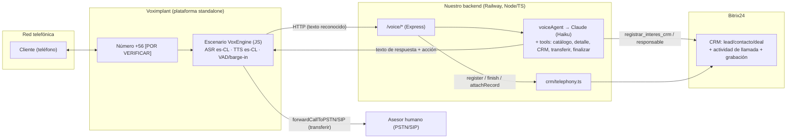
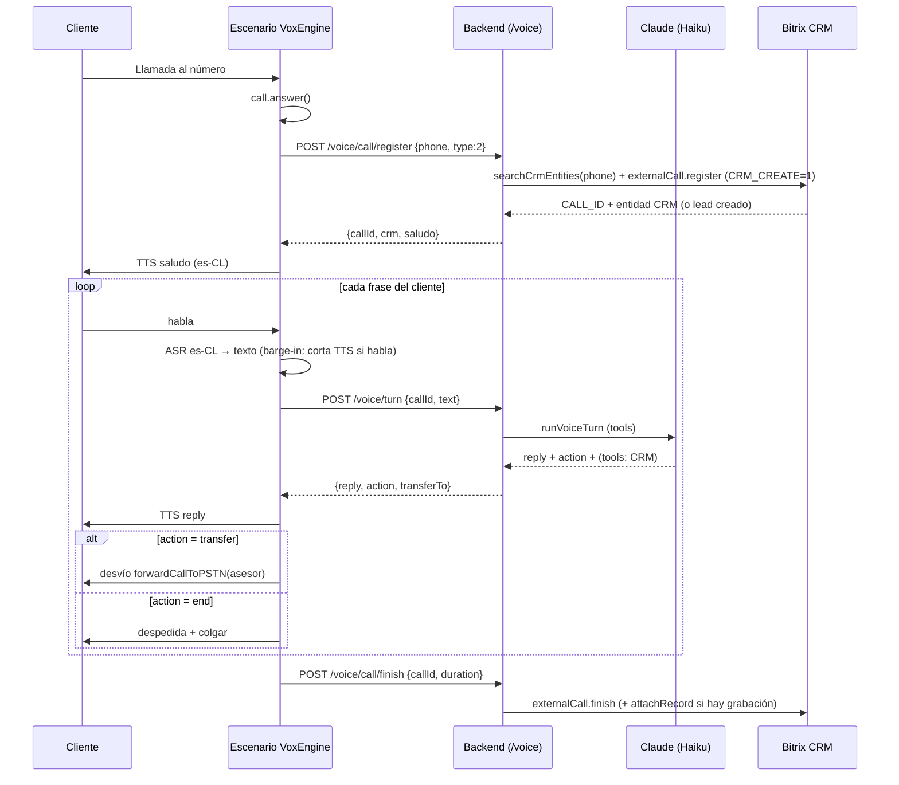

# Fase 2 — Agente de Voz Conversacional con IA (Voximplant VoxEngine + Bitrix24)

> Universidad Autónoma de Chile · Postgrados · v1.0 (2026-06-30)
> Documento de arquitectura. Todo lo técnico está **fundamentado en documentación oficial** de Voximplant y Bitrix24 (ver §14 Fuentes). Donde algo no está confirmado, se marca como **[POR VERIFICAR]**.

---

## 0. Resumen ejecutivo y decisiones

Objetivo: un **agente de voz conversacional bidireccional** (el cliente habla, la IA responde en vivo) para atención telefónica de Postgrados, tanto **entrante** (la IA contesta) como **saliente** (la IA llama a leads). El "cerebro" es **Claude** y reutiliza el catálogo, el detalle de programas y la integración CRM que ya construimos para el chat.

Decisiones tomadas:

| Decisión | Elección | Motivo |
|---|---|---|
| Plataforma de telefonía | **Voximplant standalone (VoxEngine)** | Es la única vía para correr escenarios propios con ASR+TTS+HTTP a un LLM; la telefonía nativa de Bitrix es Voximplant pero **cerrada** (no admite escenarios propios). |
| Dirección | **Entrante + Saliente** | Atención 24/7 + llamadas proactivas a leads calientes. |
| Prioridad | **Equilibrado** | Claude **Haiku 4.5** para la conversación (latencia/costo), con opción de fallback a Sonnet en casos complejos; TTS de calidad es-CL. |
| STT | **Voximplant ASR, Google `es_CL`** | Español de Chile nativo (también disponible en Microsoft). |
| TTS | **Voximplant TTS, Microsoft Neural `es_CL`** (Catalina/Lorenzo); ElevenLabs realtime como upgrade premium | Únicas voces es-CL nativas; ElevenLabs para máxima naturalidad. |
| Registro en CRM | **`telephony.externalCall.*`** (camino A) | Mantiene nuestro escenario propio y registra llamada + lead/contacto + grabación en Bitrix. |

**Hecho clave (confirmado):** la API REST de Bitrix24 **no** permite que una app coloque llamadas de voz bidireccionales; solo `infocall` de una vía y click-to-call. Por eso la voz conversacional vive en **Voximplant**, y Bitrix se usa para **registrar** la llamada.

---

## 1. Qué permite y qué no permite Bitrix24 (confirmado)

- La telefonía en la nube de Bitrix24 **está construida sobre Voximplant** ("Bitrix24's team has used Voximplant cloud JavaScript and HTTP API to create a full featured virtual IP PBX").
- **No** se pueden inyectar escenarios VoxEngine propios en la telefonía **gestionada** de Bitrix. Los puntos de extensión oficiales son: rentar número, conector SIP, o la **REST API de telefonía**.
- Para escenarios propios (ASR/TTS/LLM) se requiere una **cuenta standalone de la plataforma Voximplant** (producto "For Developers"), **no** Voximplant Kit (no-code) ni la telefonía gestionada de Bitrix.

**Conclusión:** Voximplant standalone ejecuta la llamada y la IA; Bitrix registra la actividad vía `telephony.externalCall.*`.

---

## 2. Topología



**Principio de diseño:** por el canal de voz viaja **solo texto** entre Voximplant y nuestro backend (el ASR y el TTS ocurren en Voximplant). Esto minimiza latencia y complejidad (no manejamos media en bruto) y **reutiliza el mismo cerebro Claude** del chat.

> Alternativa (no elegida): hacer *streaming* del audio por WebSocket a nuestro backend y usar STT/TTS externos. Voximplant lo soporta (`call.sendMediaTo(webSocket)`), pero añade complejidad de media y VAD del lado nuestro sin beneficio claro dado que Voximplant ya tiene ASR/TTS es-CL.

---

## 3. Componentes

### 3.1 Escenario VoxEngine (en Voximplant) — [`voice/voxengine-scenario.js`](voice/voxengine-scenario.js)
- Entrante: `AppEvents.CallAlerting` → `call.answer()`.
- Saliente: se lanza con la HTTP API **`StartScenarios`** (rule_id + `script_custom_data` con el número); dentro, `VoxEngine.callPSTN(numero, callerid)`.
- ASR continuo (`VoxEngine.createASR`), TTS (`VoxEngine.createTTSPlayer`), barge-in, y HTTP (`Net.httpRequestAsync`) a nuestro backend.
- Derivación a humano: `VoxEngine.forwardCallToPSTN` / `forwardCallToSIP` (o `callPSTN` + `sendMediaBetween`).

### 3.2 Nuestro backend (Railway) — ya en el repo
- `src/routes/voice.ts`: `POST /voice/call/register`, `POST /voice/turn`, `POST /voice/call/finish` (protegidos con secreto compartido `x-voice-secret`).
- `src/voice/voiceAgent.ts`: `runVoiceTurn()` — Claude (Haiku) + tool-calling con **prompt de voz** (frases cortas, sin URLs), reusa `buscarProgramas`, `getDetalle`, `actualizarDatosCliente`, `getDealAsesores`.
- `src/crm/telephony.ts`: `searchCrmByPhone`, `registerCall`, `finishCall`, `attachCallRecord`.

### 3.3 Bitrix24
- CRM recibe el registro de la llamada (actividad en el timeline), la creación/vinculación de lead/contacto y la grabación.

---

## 4. Flujo — Llamada ENTRANTE



---

## 5. Flujo — Llamada SALIENTE

Disparador (p. ej. score ≥ umbral, o botón manual) → nuestro backend llama a la **HTTP API `StartScenarios`** de Voximplant:

```
POST https://api.voximplant.com/platform_api/StartScenarios/
  account_id, api_key, rule_id=<regla del escenario>,
  script_custom_data = {"to":"+56912345678","dealId":77}
```

Dentro del escenario: `JSON.parse(VoxEngine.customData())` → `VoxEngine.callPSTN(to, CALLER_ID)` → al `CallEvents.Connected` se hace `POST /voice/call/register {phone, type:1}` y sigue el mismo bucle. Límite: **200 requests concurrentes** a `StartScenarios` (429 si se excede); para campañas masivas, usar el módulo `CallList`.

> El `callerid` de salida debe ser un número **real alquilado** o **verificado** en Voximplant (los de prueba no sirven como caller ID).

---

## 6. Pipeline STT → Claude → TTS y barge-in

### 6.1 STT (ASR)
- `require(Modules.ASR)` + `VoxEngine.createASR({ profile: ASRProfileList.Google.es_CL, interimResults: true })`, `call.sendMediaTo(asr)`.
- Español de Chile disponible en **Google (`es_CL`)** y **Microsoft (`es_CL`)**. Deepgram solo `es_419`.
- Reconocimiento **continuo**: no se detiene solo; se decide en `ASREvents.Result`. Eventos: `Result` (`e.text`, `e.confidence`), `InterimResult`, `CaptureStarted`, `SpeechCaptured`.

### 6.2 Cerebro (Claude)
- `runVoiceTurn` usa **Claude Haiku 4.5** (`config.voiceModel`) con `max_tokens` bajo y prompt de voz. Reutiliza las herramientas del chat (consultar_programas, detalle_programa, registrar_interes_crm) + `transferir_a_asesor` + `finalizar_llamada`.
- **Equilibrado:** Haiku por defecto; se puede escalar a Sonnet en turnos marcados como complejos (mejora futura; hoy el modelo es único por config).

### 6.3 TTS
- `VoxEngine.createTTSPlayer(text, { voice: VoiceList.Microsoft.Neural.es_CL_CatalinaNeural, progressivePlayback: true })` → `player.sendMediaTo(call)`.
- **es-CL nativo solo en Microsoft Neural** (Catalina/Lorenzo). Para voz premium en tiempo real: **ElevenLabs** (`ElevenLabs.createRealtimeTTSPlayer`, requiere `apiKey`).
- Límite de `call.say`: 1500 caracteres (por eso usamos `createTTSPlayer`, que además da el objeto `Player` para el barge-in).

### 6.4 Barge-in (interrumpir al bot)
- **PoC (simple):** al `ASREvents.CaptureStarted` (o `SpeechCaptured`) → `ttsPlayer.stop()`.
- **Producción (recomendado):** módulos **Silero VAD** (`Modules.Silero`, evento `VADEvents.Result` con `speechStartAt`) + **Pipecat Turn Detection** (`Modules.Pipecat`, `endOfTurn`/`probability`) para cortar el TTS y decidir fin de turno de forma robusta.

### 6.5 Presupuesto de latencia (objetivo < 1.2 s por turno)
| Etapa | Aprox. |
|---|---|
| ASR (final de frase) | 200–500 ms |
| HTTP Voximplant → backend | 30–100 ms |
| Claude Haiku (respuesta corta) | 300–700 ms |
| TTS (con `progressivePlayback`) | 150–400 ms (primer audio) |

Mitigaciones: `progressivePlayback` en TTS, `max_tokens` bajo, Haiku, y responder frases cortas. Límite de callback en VoxEngine: **1 s** de CPU por callback (los cálculos pesados van a nuestro backend, ✔).

---

## 7. Integración con el CRM de Bitrix24

Camino **A — `telephony.externalCall.*`** (recomendado, ver `src/crm/telephony.ts`):

1. `telephony.externalCall.searchCrmEntities` `{ PHONE_NUMBER }` → busca contacto/lead por número.
2. `telephony.externalCall.register` `{ USER_ID, PHONE_NUMBER, TYPE (1 saliente/2 entrante), CRM_CREATE:1, CRM_ENTITY_TYPE/ID? }` → devuelve **CALL_ID** y crea/vincula la entidad CRM (lead si no hay match).
3. `telephony.externalCall.finish` `{ CALL_ID, USER_ID, DURATION, STATUS_CODE }` → registra la **actividad** en el timeline y las estadísticas.
4. `telephony.externalCall.attachRecord` `{ CALL_ID, RECORD_URL, FILENAME }` → adjunta la grabación (si Voximplant la expone por URL).

Durante la conversación, el agente reutiliza las mismas herramientas del chat: **`registrar_interes_crm`** (nombre/correo/teléfono/programa → actualiza contacto/deal) y **el responsable de la negociación** (`getDealAsesores`) para nombrarlo o derivar.

> ⚠️ **Requisitos de permisos (confirmado):** `telephony.externalCall.*` **solo funciona con token de APLICACIÓN OAuth** ("works only in the context of an application") y **scope `telephony`**. **No** sirve un webhook entrante. → Hay que **añadir el scope `telephony` a la app local y reinstalarla**; el backend usa `callBitrix` (token del app), no el webhook admin que usamos para el resto del CRM.

---

## 8. Derivación a un humano

Desde el escenario VoxEngine, en vivo:
- `VoxEngine.forwardCallToPSTN(numero, callerid)` → deriva a un número (p. ej. el móvil del asesor).
- `VoxEngine.forwardCallToSIP(uri)` → deriva a un endpoint SIP (p. ej. un agente/cola de Bitrix vía SIP connector).
- O `callPSTN`/`callSIP` + `VoxEngine.sendMediaBetween(call, human)` para puentear ambas patas.

El backend decide **a quién** derivar: el **responsable del deal** (`ASSIGNED_BY_ID`, ya implementado) o el fallback `VOICE_TRANSFER_FALLBACK`. **No existe** un método nativo VoxEngine que derive directo a una "cola de Bitrix" por ID: se llega por **SIP/PSTN**.

---

## 9. Costos (órdenes de magnitud, a validar)

Costo por minuto ≈ **telefonía Voximplant (número + minutos) + ASR + TTS + Claude**. Con ~18.000 leads/mes conviene: (a) usar la voz para segmentos de alto valor / horarios sin asesores, (b) Haiku + respuestas breves, (c) medir minutos reales en el PoC antes de escalar. Cada proveedor (Voximplant, Microsoft/ElevenLabs TTS, Anthropic) tarifa aparte; el detalle de tarifas debe tomarse de cada panel al momento del PoC.

---

## 10. Seguridad y cumplimiento

- **Consentimiento/grabación:** anunciar al inicio que la llamada es atendida por un asistente virtual y que puede ser grabada (buenas prácticas + normativa de datos personales de Chile).
- **Secreto compartido:** el escenario envía `x-voice-secret`; el backend lo valida (`VOICE_SHARED_SECRET`). Endpoints `/voice/*` rechazan requests sin el secreto.
- **Datos:** solo viaja texto entre Voximplant y el backend; las claves (Anthropic, Voximplant) viven en variables de entorno, nunca en el repo.
- **Alcance del token:** `telephony` en la app OAuth; las escrituras al CRM siguen por el webhook admin donde aplica.

---

## 11. Límites y riesgos (confirmados / a verificar)

- **[POR VERIFICAR] Cobertura de números +56 (Chile) en Voximplant:** la doc no lista países explícitamente; validar en el panel (puede requerir KYC o soporte). Es el mayor riesgo de viabilidad para llamadas locales.
- **es-CL:** solo Microsoft (TTS) y Google/Microsoft (ASR) lo tienen nativo. VoxTTS in-house **no** tiene español.
- **Límites VoxEngine:** 50 intentos de llamada por sesión; 3 HTTP requests activos; respuesta HTTP ≤ 2 MB; escenario ≤ 256 KB; callback ≤ 1 s de CPU. Compatible con nuestro diseño (texto + cálculo en backend).
- **`voximplant.callback.start`** (Bitrix) usa `FROM_LINE`/`TO_NUMBER`/`TEXT_TO_PRONOUNCE` y es para la telefonía **integrada** de Bitrix, **no** para nuestro Voximplant standalone.
- **Barge-in de calidad** requiere Silero/Pipecat (módulos recientes); el PoC parte con barge-in por `CaptureStarted`.

---

## 12. Plan de PoC por hitos

| Hito | Entregable | Criterio de aceptación |
|---|---|---|
| **V0 — Cuentas** | Voximplant app + número + scope `telephony` en Bitrix | Número que timbra; token OAuth con `telephony`. |
| **V1 — Eco de voz** | Escenario contesta, ASR→texto→TTS repite | El escenario transcribe es-CL y responde por voz. |
| **V2 — Cerebro** | `/voice/turn` con Claude + catálogo | La IA responde preguntas de programas por voz, con barge-in. |
| **V3 — CRM** | register/finish/attachRecord + `registrar_interes_crm` | La llamada queda en el CRM con lead/contacto y datos capturados. |
| **V4 — Derivación** | `transferir_a_asesor` → forward al responsable | La llamada se transfiere al asesor asignado. |
| **V5 — Saliente** | `StartScenarios` desde score alto | La IA llama a un lead caliente y conversa. |

Prerrequisitos que aporta el usuario: cuenta Voximplant (+ número Chile), claves (Anthropic ya está; TTS premium opcional), scope `telephony` + reinstalación de la app.

---

## 13. Qué ya está en el repositorio (esqueleto)

- `src/crm/telephony.ts` — `telephony.externalCall.*` (register/finish/attachRecord/searchCrmEntities).
- `src/voice/voiceAgent.ts` — `runVoiceTurn` (Claude Haiku + tools de voz).
- `src/routes/voice.ts` — endpoints `/voice/call/register`, `/voice/turn`, `/voice/call/finish` (con secreto).
- `src/config.ts` — `voiceUserId`, `voiceLineNumber`, `voiceModel`, `voiceTransferFallback`, `voiceSharedSecret`.
- `voice/voxengine-scenario.js` — escenario de referencia para Voximplant.
- `voice/README.md` — pasos de despliegue.

Compila (`tsc`) y expone los endpoints. Falta conectar cuentas reales para pruebas end-to-end (hitos V0–V1).

---

## 14. Fuentes (documentación oficial)

**Voximplant**
- Escenarios / llamadas: https://voximplant.com/docs/guides/calls/scenarios · AppEvents `CallAlerting`, CallEvents.
- Saliente: https://voximplant.com/docs/references/voxengine/voxengine/callpstn · StartScenarios: https://voximplant.com/docs/references/httpapi/scenarios/startscenarios
- ASR: https://voximplant.com/docs/guides/speech/asr · https://voximplant.com/docs/references/voxengine/asrprofilelist
- TTS: https://voximplant.com/docs/guides/speech/tts · realtime: https://voximplant.com/docs/guides/speech/realtime-tts
- HTTP: https://voximplant.com/docs/references/voxengine/net/httprequestasync
- WebSocket/media: https://voximplant.com/docs/guides/media-streams/websocket
- VAD/turn-taking: https://voximplant.com/docs/guides/speech/vad-turn-detection · "Bring your own LLM": https://voximplant.com/docs/voice-ai/bring-your-own-llm
- Reenvío: https://voximplant.com/docs/references/voxengine/voxengine/forwardcalltopstn · /forwardcalltosip
- Números / rules: https://voximplant.com/docs/getting-started/basic-concepts/phone-numbers · /routing-rules
- Límites: https://voximplant.com/docs/guides/voxengine/limits · Bitrix24 case study: https://voximplant.com/case-studies/bitrix24

**Bitrix24 (Telephony REST)**
- Índice: https://apidocs.bitrix24.com/api-reference/telephony/index.html
- register: https://apidocs.bitrix24.com/api-reference/telephony/telephony-external-call-register.html
- finish: https://apidocs.bitrix24.com/api-reference/telephony/telephony-external-call-finish.html
- attachRecord: https://apidocs.bitrix24.com/api-reference/telephony/telephony-external-call-attach-record.html
- searchCrmEntities: https://apidocs.bitrix24.com/api-reference/telephony/telephony-external-call-search-crm-entities.html
- show/hide: .../telephony-external-call-show.html · .../telephony-external-call-hide.html
