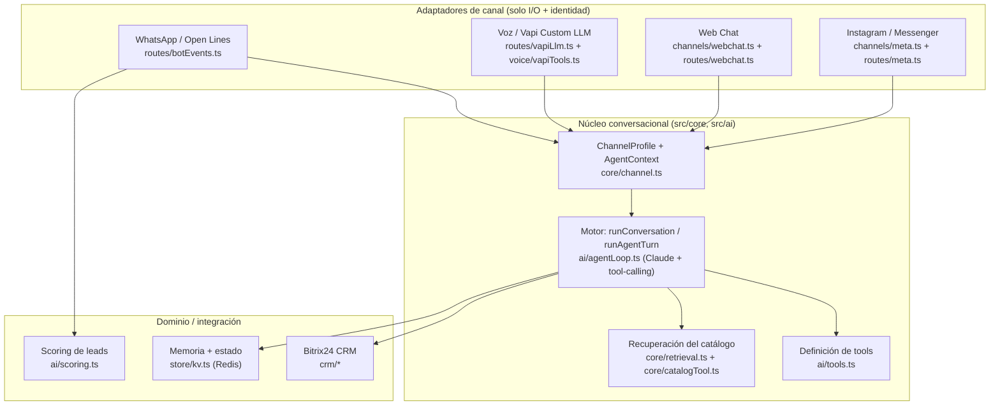

# Arquitectura Omnicanal — Agente Comercial Bitrix24

> Estado tras la evolución M0–M5 (auditoría de arquitectura). Documento para el equipo: qué existe hoy,
> cómo está organizado el núcleo, cómo agregar un canal nuevo y qué queda pendiente.

---

## 1. De dónde venimos, dónde estamos

El sistema empezó como un **PoC de un canal** (WhatsApp vía Bitrix24 Open Lines) con un **segundo cerebro**
para voz corriendo dentro de Vapi (prompt y herramientas duplicados y divergentes). La evolución lo llevó
a una **plataforma con un núcleo conversacional único**, del que cada canal es un **adaptador** que solo
traduce el formato de entrada/salida y aporta su **perfil** (tono, longitud de respuesta, capacidades).

**Stack:** Node.js ≥18 · TypeScript · Express · Anthropic (Claude Sonnet + Haiku) · Redis · Postgres ·
Vapi/Twilio (voz) · Railway. Ejecutado con `tsx` (sin build). Tests con `node:test` + CI en GitHub Actions.

---

## 2. Estado del roadmap

| Hito | Qué entregó | Estado |
|---|---|---|
| **M0** | Estado compartido en Redis (rate-limit, lock por diálogo distribuido, métricas) para escalar a >1 réplica; suite de tests + CI | ✅ desplegado |
| **M1** | Núcleo conversacional único: `ChannelProfile` + `AgentContext` + orquestador channel-agnostic; catálogo unificado | ✅ desplegado |
| **M2** | Voz al núcleo vía **Vapi Custom LLM** (mismo motor que WhatsApp); modo nativo queda como fallback | ✅ desplegado · ⚠️ falta validación EN VIVO con cuentas reales (ver [`../voice/README.md`](../voice/README.md)) |
| **M3** | Canal **Web Chat**: widget embebible + adaptador; primer canal 100% nuevo, valida el patrón | ✅ desplegado |
| **M4** | Instagram + Messenger (Meta Graph API): webhook con verificación de firma + Send API | ✅ código, ⚠️ falta aprobación de permisos de Meta (`pages_messaging`, `instagram_manage_messages`) + validación EN VIVO |
| **M5** | Servicio de **recuperación único** con mejor recall (sinónimos/áreas + ranking), determinístico, pgvector-ready | ✅ desplegado |

---

## 3. Arquitectura actual



### 3.1 El núcleo (channel-agnostic)

- **`src/core/channel.ts`** — `ChannelProfile` (modelo, `maxResponseTokens`, `systemPrompt`, `toolNames`,
  presentación del catálogo) y `AgentContext` (contexto de turno independiente del canal). Perfiles:
  `WHATSAPP_PROFILE`, `VOICE_PROFILE`, `WEBCHAT_PROFILE`, `INSTAGRAM_PROFILE`, `MESSENGER_PROFILE`; `profileFor(id)`.
- **`src/ai/agentLoop.ts`** — el **motor**:
  - `runConversation(opts, messages, execTool)`: bucle de razonamiento Claude + tool-calling
    (guardrail de 5 pasos), con el comportamiento tomado del perfil y el **ejecutor de tools inyectable**.
  - `runAgentTurn(ctx, userText, priorContext?, execTool?)`: adaptador de chat de texto que envuelve el
    motor con memoria en Redis (por `ctx.dialogId`).
- **`src/ai/tools.ts`** — definiciones de herramientas (formato Anthropic); cada perfil habilita un subconjunto.
- **`src/core/retrieval.ts`** — servicio de recuperación único del catálogo (índice enriquecido +
  sinónimos/áreas + ranking). **`src/core/catalogTool.ts`** da forma al resultado según el perfil.

### 3.2 Los adaptadores

| Canal | Entrada | Perfil | Ejecutor de tools | Orquestación |
|---|---|---|---|---|
| **WhatsApp** | `POST /events/bot/message` (evento Open Lines) | `WHATSAPP_PROFILE` | `executeTool` (`ai/toolRunner.ts`) | Nuestro motor (`runAgentTurn`) |
| **Voz (Custom LLM)** | `POST /vapi/llm/chat/completions` (OpenAI) | `VOICE_PROFILE` | `runVapiTool` (`voice/vapiTools.ts`) | Nuestro motor (`runConversation`); Vapi hace STT/TTS |
| **Voz (nativo, fallback)** | `POST /vapi/events` (tool-calls) | — (prompt en Vapi) | `runVapiTool` | Claude dentro de Vapi |
| **Web Chat** | `POST /webchat/message` + widget `GET /webchat` | `WEBCHAT_PROFILE` | `webchatExecutor` (`channels/webchat.ts`) | Nuestro motor (`runAgentTurn`) |
| **Instagram** | `POST /webhooks/meta` (`object:"instagram"`), firma `X-Hub-Signature-256` | `INSTAGRAM_PROFILE` | `metaExecutor` (`channels/meta.ts`) | Nuestro motor (`runAgentTurn`); respuesta por la Send API |
| **Messenger** | `POST /webhooks/meta` (`object:"page"`), firma `X-Hub-Signature-256` | `MESSENGER_PROFILE` | `metaExecutor` (`channels/meta.ts`) | Nuestro motor (`runAgentTurn`); respuesta por la Send API |

### 3.3 Estado compartido (M0 — para escalar a >1 réplica)

- **`store/kv.ts`** — `getRedisClient()` expone el cliente Redis para infraestructura atómica.
- **`routes/rateLimit.ts`** — rate-limit por ventana en Redis (global entre réplicas); fallback en memoria.
- **`util/distlock.ts`** — lock por diálogo **distribuido** (SET NX PX + release Lua); serializa el mismo
  cliente entre réplicas. Fallback in-process sin Redis.
- **`obs/metrics.ts`** — contadores/latencia en Redis, agregados entre réplicas.
- El semáforo de concurrencia (`MAX_CONCURRENT_TURNS`) es **por instancia** a propósito.

> Con `REDIS_URL` presente (producción) usa Redis; sin él (dev/test) cae a memoria del proceso.

---

## 4. Cómo agregar un canal nuevo (el patrón)

Un canal nuevo = **perfil + adaptador + identidad**, reusando el motor. Web Chat (M3) es el ejemplo de referencia.

1. **Perfil** — en `src/core/channel.ts`: agrega un `ChannelProfile` (modelo, longitud, prompt del canal,
   `toolNames`, presentación de catálogo) y regístralo en `profileFor`.
2. **Identidad** — define cómo se resuelve/crea la entidad CRM y el id de conversación del canal
   (WhatsApp: viene del evento Open Lines; voz: por teléfono; web: `conversationId` de navegador con
   prefijo namespaced). **Regla de seguridad:** valida/namespacea el id para que un canal no pueda leer
   la memoria de otro (ver la validación `wc-` en `routes/webchat.ts`).
3. **Adaptador** — en `src/channels/<canal>.ts`: construye un `AgentContext`/`AgentCtx` con el perfil y
   llama al motor (`runAgentTurn` para chat de texto, o el endpoint estilo Custom LLM para voz),
   inyectando el ejecutor de tools del canal (reusa `executeTool` o escribe uno como `webchatExecutor`).
4. **Ruta** — en `src/routes/<canal>.ts` + cablea en `src/index.ts` (con rate-limit y verificación de origen).
5. **Tests** — agrega `test/<canal>.test.ts` mockeando Anthropic (y el cliente Bitrix si escribe al CRM),
   como en `test/webchat.test.ts`.

---

## 5. Desarrollo, pruebas y CI

```bash
npm install
npm run typecheck        # tsc --noEmit
npm test                 # 61 tests (node:test; corren en modo memoria, sin Redis/Postgres)
npm run dev              # servidor local (requiere .env)
npm run smoke:anthropic  # valida la API de Anthropic
npm run smoke:bitrix     # valida el acceso al CRM
```

- **Tests** (`test/*.test.ts`): puros (`pure`), infraestructura M0 (`infra`), núcleo (`core`), motor
  (`agentLoop`), tools de chat/voz (`toolRunner`, `vapiTools`), escritura CRM (`crmWrite`), voz Custom LLM
  (`vapiLlm`), web chat (`webchat`), Instagram/Messenger (`meta`) y recuperación/golden set (`retrieval`).
  El mocking de módulos ESM usa `node --experimental-test-module-mocks --import tsx` (ya en el script `test`).
- **CI** (`.github/workflows/ci.yml`): typecheck + test en cada push/PR.

---

## 6. Pendientes

1. **M4 — Instagram + Messenger: código listo, falta la parte externa.** `src/channels/meta.ts` +
   `src/routes/meta.ts` (webhook con verificación de firma `X-Hub-Signature-256` + Send API), perfiles
   en `core/channel.ts`, `crearLeadSocial` en `crm/crmWrite.ts`, tests en `test/meta.test.ts`. Falta:
   (a) crear la app de Meta y pedir revisión de los permisos `pages_messaging` / `instagram_basic` /
   `instagram_manage_messages` (trámite externo, no técnico); (b) suscribir el webhook a
   `https://<host>/webhooks/meta` con `META_VERIFY_TOKEN`; (c) definir `META_APP_SECRET` y
   `META_PAGE_ACCESS_TOKEN` en Railway; (d) probar en vivo con una cuenta de prueba de Meta.
2. **Validación EN VIVO de la voz (M2).** El endpoint Custom LLM está probado contra el modelo, pero una
   llamada real necesita Vapi + Twilio +56 conectados. Checklist en [`../voice/README.md`](../voice/README.md).
   Pendientes conocidos: transferencia física de la llamada (`transferCall` desde Custom LLM) y streaming
   token-a-token.
3. **Endurecer el endpoint público de Web Chat** (allowlist de dominios / CAPTCHA) para producción.
4. **RAG vectorial (opcional).** `core/retrieval.ts` es pgvector-ready: si a futuro se agrega un proveedor
   de embeddings (p. ej. Voyage AI), se enchufa un backend vectorial sin tocar a los consumidores.

---

## 7. Referencias

- Auditoría de arquitectura original (documento aparte).
- Voz: [`../voice/README.md`](../voice/README.md), [`../Fase2-Agente-de-Voz-Vapi-Arquitectura.md`](../Fase2-Agente-de-Voz-Vapi-Arquitectura.md).
- Criterios del PoC F1: [`ACCEPTANCE.md`](ACCEPTANCE.md).
