# Documentación Técnica de Arquitectura — Agente Omnicanal Postgrados UA

> **Alcance y método:** este documento se generó leyendo íntegramente los 58 archivos TypeScript de `src/`, los 11 archivos de `test/`, `package.json`, `.env.example` y `docs/ARQUITECTURA-OMNICANAL.md`, más un grafo de importaciones extraído **programáticamente** (no a mano) desde el código fuente. Cada afirmación cita el archivo correspondiente. Donde el código no permite inferir un comportamiento, se marca explícitamente como **[NO INFERIBLE DEL CÓDIGO]**. Commit de referencia: `6fb97d2` (rama `main`).
>
> **Sobre los diagramas C4:** se usan diagramas `flowchart` de Mermaid con subgrafos rotulados por nivel (Contexto/Contenedores/Componentes) en vez de la sintaxis nativa `C4Context`/`C4Container` de Mermaid, para garantizar que se vean igual en GitHub, VS Code y Obsidian (el soporte de la sintaxis C4 nativa varía entre estas tres plataformas; `flowchart` es universal).

---

# Arquitectura General

## Qué es el sistema

Un agente comercial conversacional para el área de Postgrados de la Universidad Autónoma de Chile. Atiende **cinco canales** (WhatsApp, voz telefónica, Web Chat, Instagram, Messenger) con **un único motor conversacional** (Claude + tool-calling), integrado a **Bitrix24** como CRM de registro. El código fue evolucionando en fases documentadas en los propios commits y en `docs/ARQUITECTURA-OMNICANAL.md`: partió como un bot de un solo canal (WhatsApp) y llegó a la arquitectura "núcleo + adaptadores" que describe este documento.

## Principio de diseño

> Un canal nuevo = **un perfil** (`src/core/channel.ts`) + **un adaptador** (`src/channels/<canal>.ts` o `src/routes/<canal>.ts`) + **una estrategia de identidad**. El motor de razonamiento (`src/ai/agentLoop.ts`) y las herramientas de catálogo (`src/core/catalogTool.ts`, `src/core/retrieval.ts`) se reutilizan sin duplicarse.

Esto es verificable en el código: `runConversation()` (`src/ai/agentLoop.ts:31`) no conoce ningún canal específico — recibe un `ChannelProfile` y un `ToolExecutor` inyectado, y los cuatro adaptadores de texto (WhatsApp, Web Chat, Instagram, Messenger) lo invocan de la misma forma.

## Diagrama de flujo general

El enunciado pedido (Cliente → Canales → Open Lines → Bot → Agent Loop → Herramientas → CRM → Base de Datos → LLM → Respuesta) **no es literalmente una tubería lineal** en el código: el LLM y las Herramientas se llaman en un **bucle** (hasta 5 iteraciones, `MAX_STEPS` en `src/ai/agentLoop.ts:11`), y la Base de Datos (Postgres) se escribe de forma **asíncrona** (auditoría, no bloquea la respuesta). El diagrama siguiente refleja el flujo real:

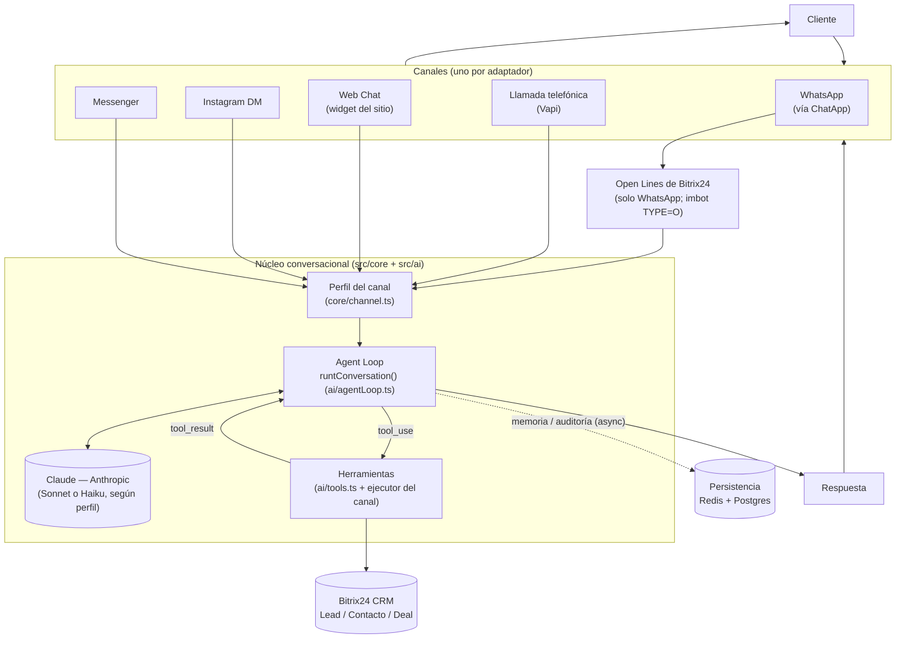

**Lectura del diagrama:** el LLM y las Herramientas forman un ciclo (`LOOP <--> LLM`, `LOOP -- tool_use --> HERR --> LOOP`), no una secuencia de un solo paso; esto es literal en el código (`for (let step = 0; step < MAX_STEPS; step++)`, `src/ai/agentLoop.ts:40`). La escritura a Bitrix24 ocurre **dentro** del ciclo (cuando el modelo invoca `registrar_interes_crm`), mientras que la escritura a Postgres (auditoría, scoring) ocurre **después**, en segundo plano, sin bloquear la respuesta al cliente.

## Arquitectura de carpetas

```mermaid
flowchart TB
  SRC["src/"]
  SRC --> AI["ai/ — el CEREBRO: motor de razonamiento, prompts, memoria, scoring, briefing"]
  SRC --> CORE["core/ — capacidades COMPARTIDAS por todos los canales: perfiles, catálogo, recuperación"]
  SRC --> CHANNELS["channels/ — adaptadores de canales de TEXTO puro (Web Chat, Meta)"]
  SRC --> ROUTES["routes/ — capa HTTP: 28 endpoints Express, guards, rate-limit"]
  SRC --> CRM["crm/ — integración de negocio con Bitrix24 (lectura/escritura CRM, telefonía, scoring)"]
  SRC --> BITRIX["bitrix/ — cliente REST/OAuth de Bitrix24 (bajo nivel, sin lógica de negocio)"]
  SRC --> VOICE["voice/ — llamadas salientes y ejecutor de tools de voz (Vapi)"]
  SRC --> BOT["bot/ — registro del bot de Open Lines"]
  SRC --> STORE["store/ — persistencia: KV (Redis/memoria), Postgres, cifrado de tokens"]
  SRC --> OBS["obs/ — observabilidad: métricas, auditoría, redacción PII, contexto de request"]
  SRC --> UTIL["util/ — primitivas de concurrencia (semáforo, lock por clave, lock distribuido)"]
  SRC --> ROOT["(raíz) — config.ts, index.ts, log.ts, session.ts, store.ts"]
```

| Carpeta | Responsabilidad | Depende de | Del que dependen (fan-in aprox.) |
|---|---|---|---|
| `ai/` | Motor conversacional: loop de razonamiento (`agentLoop.ts`), definición de tools (`tools.ts`), dispatcher de tools de chat (`toolRunner.ts`), memoria de corto plazo (`memory.ts`), scoring de leads (`scoring.ts`), resumen para el asesor (`briefing.ts`), cliente Anthropic (`client.ts`), catálogo estático (`catalog.ts`, `detalles.ts`), prompt de WhatsApp (`prompt.ts`) | `core`, `crm`, `bitrix`, `obs`, `store`, `voice` | `routes`, `channels` |
| `core/` | Capacidades **channel-agnostic** reutilizadas por todos los canales: `channel.ts` (perfiles), `catalogTool.ts` (shaping de resultados), `retrieval.ts` (búsqueda del catálogo) | `ai` (solo tipos/datos) | `ai`, `channels`, `voice`, `routes` |
| `channels/` | Adaptadores de canales 100% texto que NO usan Open Lines ni Vapi: `webchat.ts`, `meta.ts` | `ai`, `core`, `crm`, `store` | `routes` |
| `routes/` | Capa HTTP (Express): un archivo por grupo de endpoints; nunca es importada por lógica de negocio (confirmado por el grafo: 0 aristas entrantes desde otras carpetas) | prácticamente todas | — (es la capa más externa) |
| `crm/` | Integración de negocio con Bitrix24: resolución de entidades (`entities.ts`), binding chat↔CRM (`chat.ts`), escrituras (`crmWrite.ts`), directorio de usuarios/deals (`directory.ts`), acciones de voz (`voiceActions.ts`), telefonía (`telephony.ts`), analítica de llamadas (`callStats.ts`, `callSync.ts`); `openlinesCrm.ts` es un **barrel** que re-exporta los 5 anteriores | `bitrix`, `store` | `ai`, `channels`, `voice`, `routes` |
| `bitrix/` | Cliente REST/OAuth de bajo nivel: `client.ts` (throttle + reintentos), `auth.ts` (extrae credenciales del request), `refresh.ts` (renueva el token, single-flight), `placement.ts` (embebe páginas en Bitrix24), `verifyEvent.ts` (firma de webhooks), `types.ts` (formas de respuesta) | `store` | `crm`, `bot`, `routes` |
| `voice/` | `outbound.ts` (dispara llamada saliente vía Vapi), `vapiTools.ts` (ejecutor de tools del canal de voz, compartido entre modo nativo y Custom LLM) | `core`, `crm`, `store` | `ai`, `routes` |
| `bot/` | `register.ts`: alta/baja del bot de Open Lines (`imbot.register`) | `bitrix` | `routes` |
| `store/` | `kv.ts` (Redis o memoria + cliente Redis crudo), `db.ts` (Postgres: auditoría + espejo de llamadas), `tokenCrypto.ts` (AES-256-GCM para tokens OAuth) | — (capa base) | casi todas |
| `obs/` | `metrics.ts` (contadores/latencia), `audit.ts` (auditoría con redacción), `redact.ts` (enmascara PII), `requestContext.ts` (correlación por request vía `AsyncLocalStorage`) | `store` | `ai`, `routes`, `log.ts` |
| `util/` | `concurrency.ts` (semáforo + lock por clave in-process), `distlock.ts` (lock distribuido vía Redis) | `store` | `routes` |
| raíz (`config.ts`, `index.ts`, `log.ts`, `session.ts`, `store.ts`) | Configuración global, bootstrap Express, logger, sesión de diálogo, estado del app (auth/botId/appToken) | `store/kv` | prácticamente todas |

---

# Flujo del Sistema

## Secuencia completa: WhatsApp de punta a punta

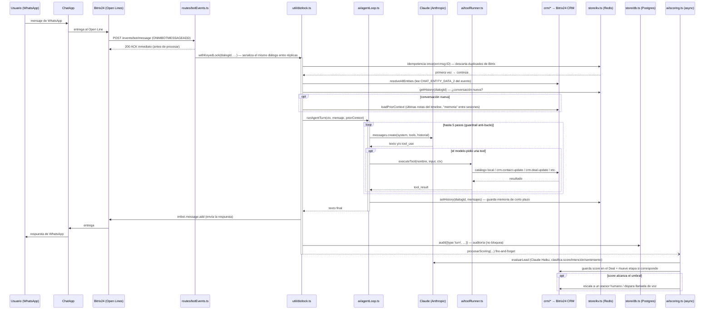

**Puntos verificables en el código:**
- El ACK a Bitrix ocurre **antes** de procesar (`res.status(200).json({ok:true})` en `src/routes/botEvents.ts:38`, luego `void withKeyedLock(...)`), para no bloquear el webhook.
- El lock por diálogo (`withKeyedLock`, `src/util/distlock.ts:30`) es **distribuido** (Redis `SET NX PX` + liberación Lua) cuando hay `REDIS_URL`; sin Redis cae a un lock in-process (`createKeyedLock`, `src/util/concurrency.ts`).
- El scoring (`procesarScoring`, `src/ai/scoring.ts:82`) corre **después** de responder al cliente, con `void ...catch(...)` (fire-and-forget, `src/routes/botEvents.ts:141`).

## Flujo del Agent Loop (detallado)

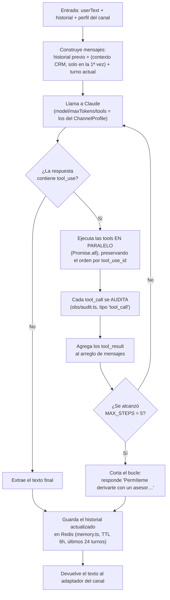

Esto corresponde exactamente a `runConversation()` (`src/ai/agentLoop.ts:31-77`) envuelto por `runAgentTurn()` (`src/ai/agentLoop.ts:85-122`) para los canales de chat de texto. El canal de voz en modo Custom LLM (`src/routes/vapiLlm.ts`) llama a `runConversation()` **directamente**, sin pasar por `runAgentTurn` (porque la memoria de la llamada la gestiona el propio Vapi, no `ai/memory.ts`).

---

# Diagramas Mermaid

## Grafo de dependencias entre módulos (por carpeta)

Extraído **programáticamente** parseando los 250 imports relativos de los 59 archivos de `src/` (script ad-hoc, no manual). Se muestran las relaciones con ≥2 archivos involucrados; el detalle completo está en la sección [Dependencias](#dependencias).

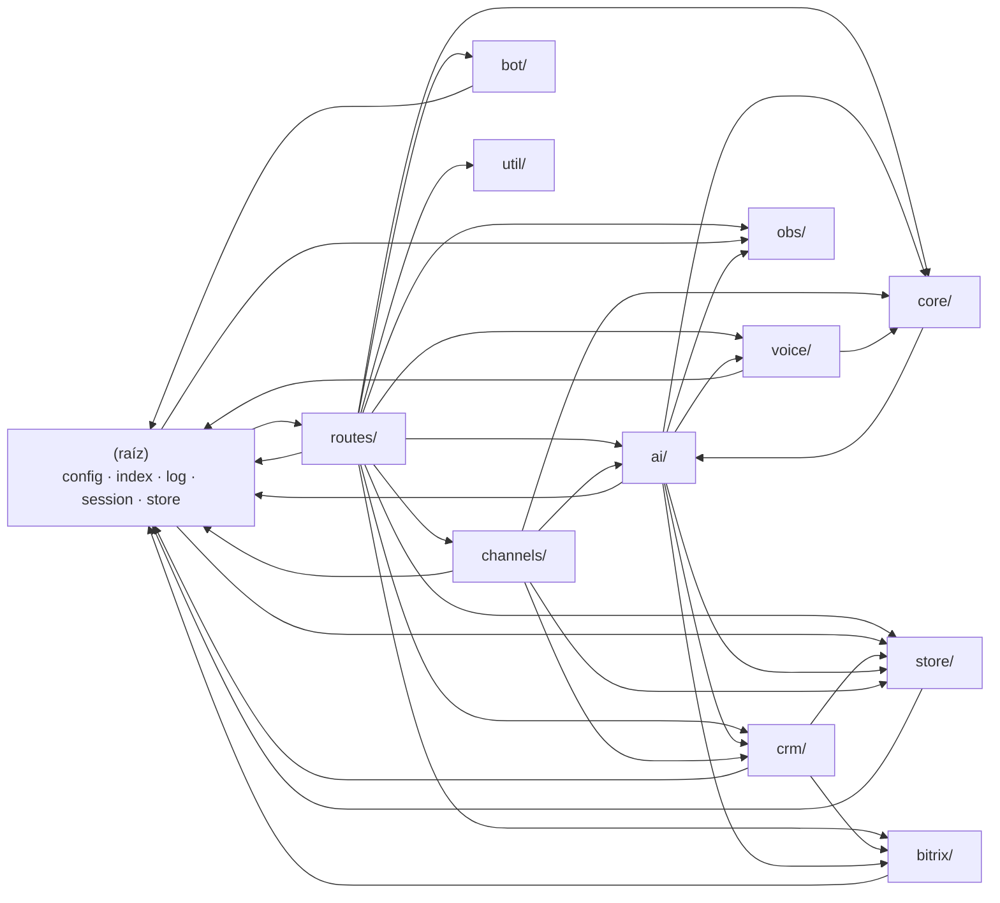

**Lectura:** `routes/` tiene 11 aristas de salida y **cero** de entrada desde otras carpetas de negocio — es la capa más externa, tal como corresponde a un backend HTTP. `core/` solo depende de `ai` (para tipos/datos del catálogo) y es consumida por `ai`, `channels`, `voice` y `routes` — es efectivamente el "núcleo compartido" que describe la documentación. `util/` y `obs/` solo dependen de `store/` y la raíz — son utilidades de bajo nivel sin acoplamiento hacia arriba (buena señal de diseño).

## Grafo de relaciones de herramientas (tools)

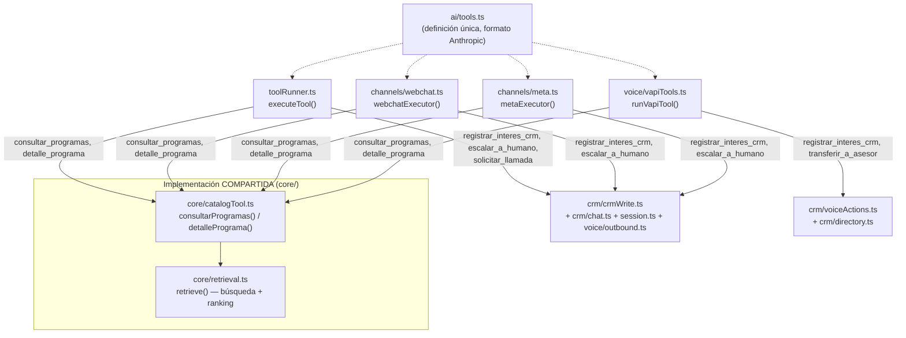

**Hallazgo verificable:** las herramientas de **catálogo** (`consultar_programas`, `detalle_programa`) están genuinamente unificadas — los 4 ejecutores llaman a las mismas dos funciones de `core/catalogTool.ts`. Las herramientas de **CRM** (`registrar_interes_crm`, `escalar_a_humano`, `solicitar_llamada`/`transferir_a_asesor`) **no** están unificadas: cada ejecutor tiene su propia lógica de resolución de identidad/lead (`toolRunner.ts` usa `dialogId`+`chatId` de Open Lines; `webchat.ts` y `meta.ts` usan un `leadId` cacheado en sesión; `vapiTools.ts` usa búsqueda por teléfono). Ver detalle en [Auditoría Técnica](#auditoría-técnica).

## Mapa de integraciones externas

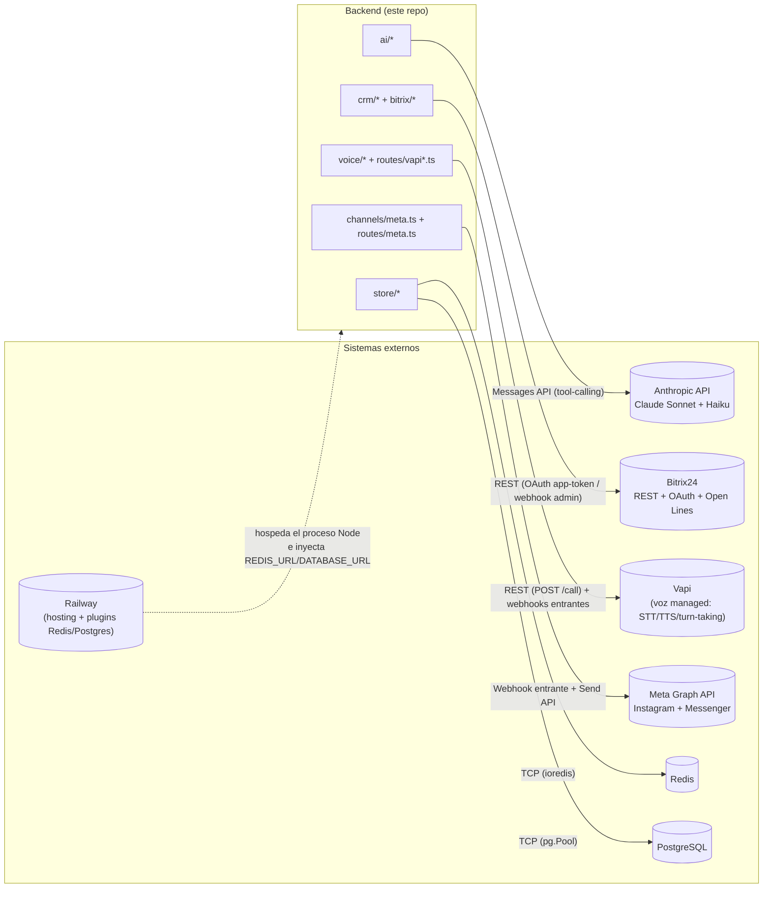

| Integración | Qué consume del sistema | Protocolo | Autenticación |
|---|---|---|---|
| **Anthropic (Claude)** | `ai/agentLoop.ts`, `ai/scoring.ts`, `ai/briefing.ts` | HTTPS REST (`@anthropic-ai/sdk`) | `ANTHROPIC_API_KEY` |
| **Bitrix24** | Casi todo `crm/*`, `bot/register.ts`, `bitrix/placement.ts` | HTTPS REST (`https://{domain}/rest/{method}`) | OAuth (app local) **o** webhook entrante admin, según el método (`src/bitrix/client.ts:120`) |
| **ChatApp / Open Lines** | Es el transporte que Bitrix24 usa para traer WhatsApp al bot; no hay integración directa en el código — el bot solo ve eventos de Open Lines (`ONIMBOTMESSAGEADD`) | — (interno a Bitrix24) | — |
| **Vapi** | `voice/outbound.ts` (saliente), `routes/vapi.ts` (modo nativo), `routes/vapiLlm.ts` (Custom LLM) | HTTPS REST + webhooks entrantes | `VAPI_API_KEY` (saliente) + `VAPI_SECRET` (verifica webhooks entrantes) |
| **Meta Graph API** | `channels/meta.ts`, `routes/meta.ts` | HTTPS webhook entrante + Send API saliente | `META_APP_SECRET` (firma HMAC del webhook), `META_PAGE_ACCESS_TOKEN` (envío) |
| **Redis** | `store/kv.ts` (sesión, memoria, idempotencia), `util/distlock.ts`, `routes/rateLimit.ts`, `obs/metrics.ts` | TCP (`ioredis`) | `REDIS_URL` |
| **PostgreSQL** | `store/db.ts` (auditoría + espejo de llamadas) | TCP (`pg`) | `DATABASE_URL` |
| **Railway** | Hosting del proceso Node; plugins gestionados de Redis/Postgres que inyectan `REDIS_URL`/`DATABASE_URL` | — | — |

---

# Modelo C4

## Nivel 1 — Contexto

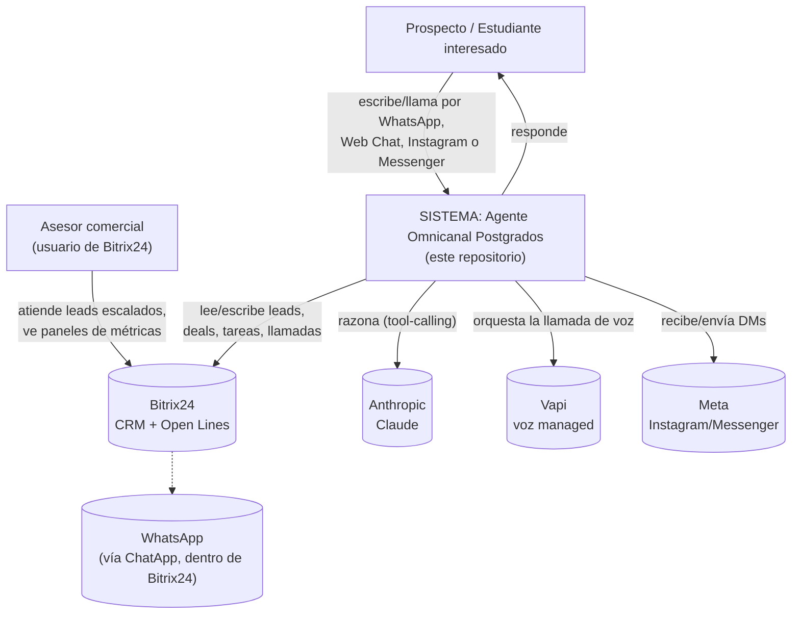

## Nivel 2 — Contenedores

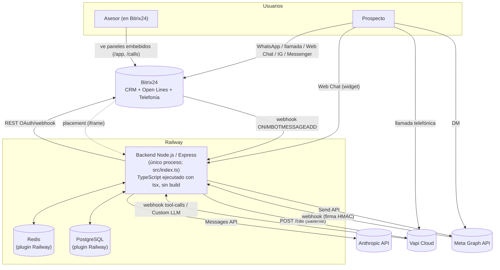

**Nota de escala:** hoy es **un solo proceso** (`app.listen`, `src/index.ts:159`). El código ya está preparado para >1 réplica (rate-limit, lock de diálogo y métricas usan Redis cuando está disponible — `store/kv.ts`, `util/distlock.ts`, `routes/rateLimit.ts`, `obs/metrics.ts`), pero Railway no está configurado con réplicas horizontales **[NO INFERIBLE DEL CÓDIGO — es una decisión de configuración de infraestructura, no de código]**.

## Nivel 3 — Componentes (dentro del contenedor Backend)

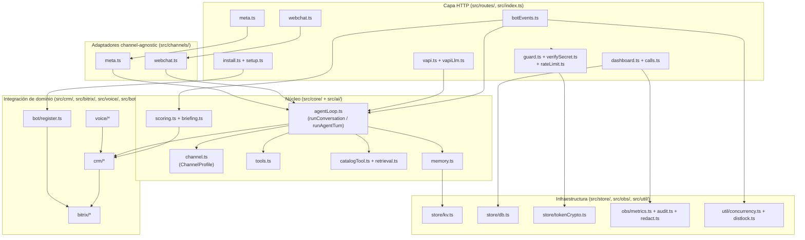

---

# Dependencias

## Módulos más utilizados (fan-in) y más dependientes (fan-out)

Datos exactos del grafo de importaciones (250 aristas internas, 59 archivos):

| Archivo | Usado por (fan-in) | Lectura |
|---|:-:|---|
| `src/log.ts` | 33 | El logger es la dependencia más transversal del proyecto — todo módulo loguea. |
| `src/store.ts` | 30 | El tipo `Auth` y `EMPTY_AUTH` se pasan por casi toda llamada a Bitrix24. |
| `src/config.ts` | 25 | Config centralizada; leída ampliamente (síntoma normal, no problema). |
| `src/store/kv.ts` | 18 | Base de la persistencia (sesión, memoria, idempotencia, locks, rate-limit). |
| `src/bitrix/client.ts` | 15 | Único punto de entrada para hablar con la API REST de Bitrix24. |
| `src/crm/openlinesCrm.ts` (barrel) | 11 | Reexporta `entities/chat/crmWrite/directory/voiceActions`; su fan-in real está repartido entre esos 5. |
| `src/bitrix/types.ts` | 9 | Tipos de respuesta de Bitrix, usados por todo `crm/*`. |

| Archivo | Depende de (fan-out) | Lectura |
|---|:-:|---|
| `src/index.ts` | 19 | Es el bootstrap: importa cada handler de ruta para cablearlo — fan-out alto aquí es **esperado y sano** (es la única "capa de composición"). |
| `src/routes/botEvents.ts` | 17 | El handler más complejo: orquesta lock distribuido, semáforo, resolución CRM, motor, auditoría y scoring. |
| `src/ai/scoring.ts` | 12 | Toca memoria, sesión, CRM, voz, briefing, Bitrix, métricas y auditoría — es el módulo con más responsabilidades transversales del proyecto. |
| `src/ai/toolRunner.ts` | 10 | Dispatcher de 5 tools de chat: catálogo, CRM, voz saliente, sesión, Bitrix. |
| `src/routes/setup.ts` | 10 | Utilidades administrativas: toca bot, CRM, placement, sync de llamadas, DB. |
| `src/routes/vapi.ts` | 10 | Webhook de voz nativo: tools de voz, telefonía, auditoría, outbound. |

## Dependencias críticas

- **`src/bitrix/client.ts`**: si falla, **todo** el sistema pierde su única vía de comunicación con el CRM (chat, voz, web chat, Meta, dashboards). Tiene reintentos (429/5xx, `QUERY_LIMIT_EXCEEDED`) y renovación de token, pero no hay una vía CRM alternativa.
- **`src/store/kv.ts`**: si `REDIS_URL` falta y `NODE_ENV=production`, el proceso **no arranca** (`throw new Error(...)`, `src/store/kv.ts:85-89`) — es una dependencia dura, no opcional, en producción.
- **`src/ai/client.ts`** (Anthropic): sin él no hay razonamiento en ningún canal — es el único proveedor de LLM del sistema (ver "podría eliminarse" más abajo, ítem sobre abstracción de proveedor).

## Qué podría eliminarse o simplificarse

- **`src/crm/openlinesCrm.ts`** ya es solo un *barrel* (11 líneas, `export * from './entities' | './chat' | './crmWrite' | './directory' | './voiceActions'`). Es un remanente de la refactorización que decompuso el antiguo módulo-dios; los imports podrían apuntar directo a los 5 submódulos y eliminar el barrel, a costa de tocar ~15 archivos que hoy importan de `../crm/openlinesCrm`.
- Los **tres archivos con `safeEqual()` duplicado** (`src/bitrix/verifyEvent.ts`, `src/routes/guard.ts`, `src/routes/verifySecret.ts`) — la misma función de comparación en tiempo constante está copiada 3 veces. Se podría extraer a `src/util/` sin cambiar comportamiento.
- Los **4 ejecutores de tools** (`toolRunner.ts`, `webchat.ts`, `meta.ts`, `vapiTools.ts`) comparten la parte de catálogo pero no la de CRM: hay margen real de unificación (ver [Auditoría Técnica](#auditoría-técnica)).

## Módulos con alto acoplamiento

Medido por fan-out (cuántos otros módulos toca), no por tamaño de archivo:

1. **`src/ai/scoring.ts`** (12 dependencias) — evalúa el lead, escribe en el CRM, mueve etapas, dispara llamadas de voz, escala a un asesor y audita, todo en una sola función (`procesarScoring`, `src/ai/scoring.ts:82-240`, 159 líneas). Es el módulo con más razones para cambiar del proyecto.
2. **`src/routes/botEvents.ts`** (17 dependencias) — es el único handler que integra lock distribuido + semáforo + contexto de request + resolución CRM + motor + auditoría + scoring. Alto fan-out aquí es más justificable (es el orquestador del canal principal), pero concentra mucha lógica en `handle()` (~95 líneas).
3. **`src/crm/openlinesCrm.ts`** como *barrel* no tiene lógica propia, pero cualquier cambio en la forma de sus 5 submódulos obliga a revisar sus 11 consumidores indirectos.

---

# Componentes

## Herramientas (Tools)

Definidas **una sola vez** en `src/ai/tools.ts` (formato Anthropic); cada `ChannelProfile.toolNames` habilita un subconjunto.

| Tool | Propósito | Parámetros (`input_schema`) | Qué devuelve | Cuándo la usa el modelo | Canales que la habilitan |
|---|---|---|---|---|---|
| `consultar_programas` | Buscar programas del catálogo (nunca inventar) | `tipo?`, `facultad?`, `modalidad?`, `texto?` | `{ok, total, mostrando, programas[], nota?}` (forma varía por perfil, ver `core/catalogTool.ts`) | Antes de informar sobre cualquier programa | Los 5 |
| `detalle_programa` | Arancel, matrícula, requisitos, malla de UN programa | `url?`, `nombre?` | Objeto completo (chat) o reducido (voz/Meta), o `SIN_DETALLE`/`encontrado:false` | Cuando preguntan por precio/requisitos de un programa concreto | Los 5 |
| `registrar_interes_crm` | Guardar datos de contacto + programa de interés | `nombre?`, `apellido?`, `email?`, `telefono?`, `rut?`, `programa_interes?`, `comentario?` | `{ok, actualizado[]}` o `{ok:false, error}` | Apenas el cliente entrega un dato nuevo | Los 5 |
| `solicitar_llamada` | Disparar una llamada de voz inmediata (Vapi) | `telefono` (requerido, valida E.164 chileno `+569XXXXXXXX`), `motivo?` | `{ok, llamando, mensaje}` o error (`TELEFONO_INVALIDO`, `LIMITE_LLAMADAS` — máx. 1/hora/diálogo) | Solo si el cliente ACEPTA que lo llamen | Solo WhatsApp (`WHATSAPP_PROFILE`) |
| `escalar_a_humano` | Derivar la conversación a un asesor | `motivo` (requerido) | `{ok, escalado, asesor?, mensaje}` | Pide hablar con alguien / intención alta / pregunta fuera de alcance | WhatsApp, Web Chat, Instagram, Messenger |
| `transferir_a_asesor` | Derivar la LLAMADA en curso | `motivo` (requerido) | `{transferir, asesor, destino}` | Análogo a `escalar_a_humano`, pero para voz | Solo Voz (`VOICE_PROFILE`) |

**Dependencias por tool** (qué módulos toca cada una al ejecutarse):
- `consultar_programas` / `detalle_programa` → `core/retrieval.ts` (búsqueda) + `ai/detalles.ts` (detalle) — **sin llamadas de red**, 100% en memoria del proceso.
- `registrar_interes_crm` → `crm/crmWrite.ts` (+ `crm/chat.ts` para resolver la entidad en WhatsApp) → Bitrix24 REST.
- `solicitar_llamada` → `voice/outbound.ts` → Vapi REST + `crm/crmWrite.ts` (guarda el teléfono).
- `escalar_a_humano` → `session.ts` (marca `humanTookOver`) + `ai/briefing.ts` (resumen con Claude Haiku) + `crm/directory.ts` (nombre del asesor) + Bitrix24 REST.
- `transferir_a_asesor` → `crm/directory.ts` + `crm/voiceActions.ts` (cache de contexto de la llamada).

## Endpoints (Eventos)

28 rutas registradas en `src/index.ts`. Middlewares: `globalLimiter` (600 req/min/IP, aplicado a **todas** las rutas), `strictLimiter` (240 req/min/IP, en endpoints que llaman al LLM o disparan llamadas), `requireDashboardToken`/`requireAdminToken` (secreto fijo vía header o query, fail-closed en producción), `verifyBitrixEvent`/`verifyVapiSecret`/`verifyMetaSignature` (verifican el origen del webhook).

| Ruta | Método | Guard | Quién la llama | Qué hace | Qué devuelve |
|---|---|---|---|---|---|
| `/` | ALL | — | Bitrix24 (al abrir la app) | Página estática de confirmación | HTML |
| `/health` | GET | — | Railway (healthcheck) | Estado del proceso + backend KV | `{ok, kv, persistent, t}` |
| `/debug/config` | GET | dashboard token | Operador (diagnóstico) | Config cargada (sin secretos) | JSON |
| `/app` | ALL | dashboard token | Bitrix24 (placement/iframe) | Panel de métricas (HTML+JS embebido) | HTML |
| `/metrics/summary` | GET | dashboard token | El panel `/app` (fetch) | Métricas de negocio (Postgres) + técnicas (Redis/memoria) | JSON |
| `/calls` | ALL | dashboard token | Bitrix24 (placement/iframe) | Panel de analítica de llamadas | HTML |
| `/calls/data` | GET | dashboard token | El panel `/calls` (fetch) | KPIs de telefonía (Postgres o REST en vivo) | JSON |
| `/metrics` | GET | dashboard token | Operador / monitoreo | Contadores + latencia LLM en crudo | JSON |
| `/stats` | GET | dashboard token | Operador | Métricas + auditoría reciente | HTML |
| `/install` | ALL | — (valida `application_token` si está seteado) | Bitrix24 (al instalar la app local) | Guarda `auth`, registra el bot, enlaza el dashboard | HTML |
| `/events/bot/message` | POST | strict + `verifyBitrixEvent` | Bitrix24 (Open Lines) | Turno completo del agente (ver secuencia arriba) | `{ok:true}` (ACK) |
| `/events/bot/welcome` | POST | strict + `verifyBitrixEvent` | Bitrix24 | No-op (el saludo lo da el agente en el primer mensaje) | `{ok:true}` |
| `/events/bot/delete` | POST | strict + `verifyBitrixEvent` | Bitrix24 | No-op (ack) | `{ok:true}` |
| `/setup/register-bot` | GET | admin token | Operador | Registra el bot manualmente | `{ok, botId}` |
| `/setup/unregister-bot` | GET | admin token | Operador | Desregistra el bot | `{ok}` |
| `/setup/deal-stages` | GET | admin token | Operador | Lista etapas por embudo (diagnóstico) | JSON |
| `/setup/deal-responsable` | GET | admin token | Operador | Responsable/observadores de un deal | JSON |
| `/setup/bind-dashboard` | GET | admin token | Operador | (Re)enlaza `/app` como placement | JSON |
| `/setup/bind-calls` | GET | admin token | Operador | (Re)enlaza `/calls` como placement | JSON |
| `/setup/sync-calls` | GET | admin token | Operador | Sincroniza `voximplant.statistic.get` → Postgres (async) | `{ok, started}` |
| `/vapi/events` | POST | `verifyVapiSecret` | Vapi (modo nativo) | Ejecuta tool-calls o registra `end-of-call-report` | `{results}` / `{ok}` |
| `/voice/outbound` | POST | strict + `verifyVapiSecret` | Este mismo backend (scoring) u operador | Dispara una llamada saliente | `{ok, callId}` |
| `/vapi/llm/chat/completions` | POST | strict + `verifyVapiSecret` | Vapi (modo Custom LLM) | Corre `runConversation` con `VOICE_PROFILE` | Formato OpenAI (`chat.completion`) |
| `/vapi/llm` | POST | strict + `verifyVapiSecret` | Vapi (alias) | Igual que el anterior | Igual |
| `/webchat` | GET | — | Visitante del sitio | Widget de chat (HTML+JS autocontenido) | HTML |
| `/webchat/message` | POST | strict | Widget de Web Chat | Turno del agente (perfil Web Chat) | `{ok, conversationId, reply}` |
| `/webhooks/meta` | GET | — | Meta (una vez, al suscribir) | Handshake `hub.challenge` | texto plano |
| `/webhooks/meta` | POST | strict + `verifyMetaSignature` | Meta (Instagram/Messenger) | Turno del agente por DM | `{}` (ACK; la respuesta va por la Send API) |

---

# Integraciones

Ver también el [Mapa de integraciones externas](#mapa-de-integraciones-externas) más arriba (diagrama). Detalle de autenticación por integración:

- **OAuth (Bitrix24):** la app local usa `access_token`/`refresh_token` extraídos de cada evento (`src/bitrix/auth.ts`). Se renueva on-demand ante `expired_token`/`invalid_token`, con *single-flight* (`src/bitrix/refresh.ts:14-23`) para no rotar el refresh_token en paralelo. Los tokens se cifran en reposo con AES-256-GCM si hay `TOKEN_ENC_KEY` (`src/store/tokenCrypto.ts`, degradación transparente a texto plano si falta la clave).
- **Webhook admin (Bitrix24):** alternativa sin OAuth para **escrituras CRM** (`BITRIX_WEBHOOK_URL`), porque el token de la app es "no-Intranet" con permisos CRM limitados (`src/bitrix/client.ts:115-123`). Los métodos de **telefonía** (`telephony.externalCall.*`) exigen sí o sí el token de aplicación OAuth (`src/crm/telephony.ts:6-9`).
- **REST API (Bitrix24):** todas las llamadas pasan por un *leaky bucket* (`Bottleneck`, 2 req/s, ráfaga 50, 2 concurrentes — `src/bitrix/client.ts:6-12`), con reintentos ante 429/5xx y `QUERY_LIMIT_EXCEEDED`.
- **Webhooks entrantes propios:** `/events/bot/*` (firma vía `application_token` de Bitrix), `/vapi/events`+`/vapi/llm*` (secreto compartido `VAPI_SECRET`), `/webhooks/meta` (firma HMAC-SHA256 `X-Hub-Signature-256` con `META_APP_SECRET`, calculada sobre el body crudo capturado en `src/index.ts` vía el `verify` de `express.json`).

---

# Persistencia

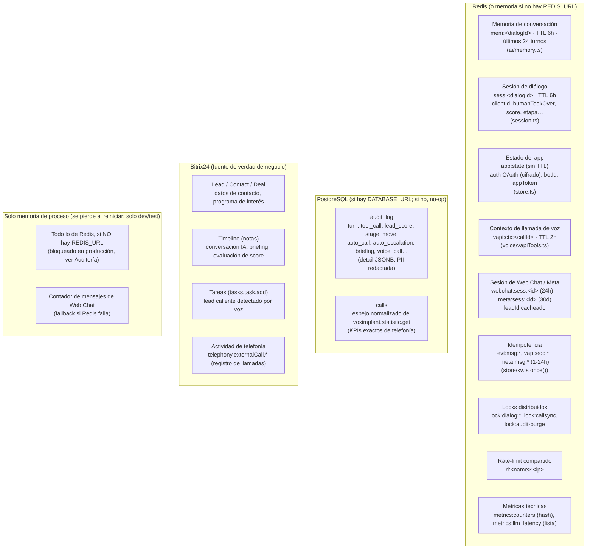

| Dato | Dónde vive | TTL / retención | Evidencia |
|---|---|---|---|
| Historial de conversación (chat) | Redis | 6 h de inactividad, máx. 24 turnos | `src/ai/memory.ts:6-7` |
| Sesión de diálogo (quién es el cliente, si un humano tomó el control, último score) | Redis | 6 h | `src/session.ts:20-21` |
| Auth OAuth + botId + appToken | Redis | Sin TTL (persistente) | `src/store.ts:18` |
| Contexto CRM de una llamada de voz | Redis | 2 h | `src/voice/vapiTools.ts:27` |
| Sesión de Web Chat (leadId) | Redis | 24 h | `src/channels/webchat.ts:21` |
| Sesión de Instagram/Messenger (leadId) | Redis | 30 días | `src/channels/meta.ts:21` |
| Auditoría completa de eventos | Postgres (`audit_log`) | Indefinida, o purgada si `AUDIT_RETENTION_DAYS>0` | `src/store/db.ts:33-45, 108-138` |
| Espejo de llamadas telefónicas | Postgres (`calls`) | Indefinida | `src/store/db.ts:47-66` |
| Datos de contacto, programa de interés, notas | Bitrix24 (Lead/Contact/Deal/Timeline) | Indefinida (es el CRM del negocio) | `src/crm/crmWrite.ts` |
| Grabación y transcripción de llamadas | Bitrix24 (actividad de telefonía) | Indefinida | `src/crm/telephony.ts` |

---

# Observabilidad

| Mecanismo | Implementación | Detalle |
|---|---|---|
| **Logs** | `src/log.ts` | Una línea de texto plano por evento (`console.log`), con redacción de PII (`LOG_REDACT=off` para desactivar) y correlación automática de `reqId`/`dialogId` vía `AsyncLocalStorage` (`src/obs/requestContext.ts`). |
| **Métricas técnicas** | `src/obs/metrics.ts` | Contadores (`inc()`) y latencia del LLM (avg/p95); en Redis (hash + lista acotada a 500) si hay `REDIS_URL`, en memoria si no. Expuestas en `GET /metrics`. |
| **Auditoría de negocio** | `src/obs/audit.ts` + `src/store/db.ts` | Cada evento de negocio (`turn`, `tool_call`, `lead_score`, `stage_move`, `auto_call`, `auto_escalation`, `briefing`, `voice_call`, `voice_tool`, `operator_msg`) se loguea y persiste en `audit_log` (Postgres), con el campo `detail` **redactado** (`redactPII`) antes de guardarse. |
| **Health check** | `GET /health` | Sin autenticación (lo necesita Railway); reporta `kv` (`redis`/`memory`) y `persistent`. |
| **Panel de estadísticas** | `GET /stats` | HTML con snapshot de métricas + últimas 25 filas de auditoría (sin el campo `detail`, para no exponer PII/conversaciones en el panel). |
| **Panel de negocio** | `GET /app` (+ `GET /metrics/summary`) | Conversaciones, leads capturados, escalamientos, score promedio, por embudo, por asesor, demanda de programas, gaps del catálogo, horarios — todo agregado desde `audit_log` vía SQL (`dbMetricsSummary`, `src/store/db.ts:314-389`). |
| **Analítica de llamadas** | `GET /calls` (+ `GET /calls/data`) | KPIs exactos (si hay Postgres sincronizado) o muestra en vivo (REST) de `voximplant.statistic.get`. |
| **Latencias** | `recordLlmLatency()` | Cada llamada a Claude en `runConversation` mide su duración (`src/ai/agentLoop.ts:41,50`); expuesta como avg/p95 en `/metrics` y `/app`. |
| **Errores** | Contador `errors` (agentLoop) + `errors:audit` (fallos al insertar auditoría, `src/store/db.ts:84`) | Los `catch` de casi toda llamada externa loguean con `log.warn`/`log.error` y degradan con gracia (no propagan la excepción al usuario final). |
| **Redacción de PII** | `src/obs/redact.ts` | Enmascara emails y teléfonos (formato E.164 y móvil chileno) en logs y en `detail` de auditoría, preservando la estructura del objeto. |

---

# Auditoría Técnica

> Esta auditoría refleja el **estado actual** del código (`main`, commit `6fb97d2`), que ya incorpora una ronda de *hardening* y la refactorización M0–M5 hacia el núcleo omnicanal. No repite hallazgos de auditorías anteriores que ya fueron resueltos por esos cambios (verificación de firma de webhooks, cifrado de tokens, redacción de PII, descomposición del módulo-dios de CRM, tests, CI) — esos ya están implementados y se puede confirmar leyendo `src/bitrix/verifyEvent.ts`, `src/store/tokenCrypto.ts`, `src/obs/redact.ts`, `src/crm/{entities,chat,crmWrite,directory,voiceActions}.ts`, `test/*.test.ts` (74 tests) y `.github/workflows/ci.yml`.

## Código duplicado

- **`safeEqual()` (comparación en tiempo constante)** está copiada literalmente en `src/bitrix/verifyEvent.ts:7-10`, `src/routes/guard.ts:7-10` y `src/routes/verifySecret.ts:7-10`. Bajo riesgo (la lógica es correcta en los 3), pero es la definición de código duplicado: un cambio (p. ej. usar `crypto.subtle` en vez de `timingSafeEqual`) requeriría tocar 3 archivos idénticos.
- **Lógica de "crear lead + fusionar datos"** repetida con variaciones menores en `crm/crmWrite.ts` (`crearLeadWeb`, `crearLeadSocial`) y `crm/voiceActions.ts` (`crearLeadDesdeVoz`) — mismo patrón (`TITLE`, `SOURCE_ID`, campos, nota), 3 implementaciones casi idénticas que solo cambian el `SOURCE_ID` y el prefijo del título.
- **4 ejecutores de tools** (`toolRunner.executeTool`, `webchat.webchatExecutor`, `meta.metaExecutor`, `vapiTools.runVapiTool`) repiten el mismo `switch` de 4-5 `case` con lógica de CRM ligeramente distinta por canal. La parte de catálogo ya está unificada (`core/catalogTool.ts`); la de CRM no.

## Dependencias innecesarias

No se detectaron dependencias npm sin uso: las 6 dependencias de producción (`@anthropic-ai/sdk`, `bottleneck`, `dotenv`, `express`, `ioredis`, `pg`) y `tsx` (movida a `dependencies` porque es el runtime, no una herramienta de desarrollo) tienen uso verificable y directo. Es una fortaleza real del proyecto: sin frameworks superfluos.

## Servicios/módulos demasiado grandes

- **`src/ai/scoring.ts`** — `procesarScoring()` (159 líneas) hace 5 cosas distintas en una sola función: mover etapa del deal, auto-llamar por voz, auto-escalar a humano, persistir el score y emitir métricas/auditoría. Cumple con lo que documenta, pero viola *Single Responsibility* a nivel de función.
- **`src/routes/botEvents.ts`** — `handle()` (~95 líneas) orquesta idempotencia, control de "quién habla" (cliente vs. operador), resolución CRM, memoria previa, el motor, el registro en CRM y el disparo de scoring. Es manejable por los comentarios y la estructura secuencial, pero es el archivo con más responsabilidades transversales del proyecto (17 dependencias).
- **`src/routes/dashboard.ts`** y **`src/routes/calls.ts`** — cada uno embebe ~250 líneas de HTML+CSS+JS como un *template string* dentro del archivo de rutas. Funciona, pero no tiene tipos, tests, ni se puede lintear como frontend.

## Alto acoplamiento / baja cohesión

- `src/ai/scoring.ts` (12 dependencias) es el módulo con mayor acoplamiento de salida del proyecto — ver [Dependencias](#dependencias).
- El **contexto de conversación** está representado por **2 tipos paralelos** (`AgentCtx` en `ai/toolRunner.ts` para chat, `AgentContext` en `core/channel.ts` para el resto) que se solapan pero no son el mismo tipo — el motor (`runConversation`) usa `AgentContext`/`ConversationOpts`, mientras que `runAgentTurn` (usado por WhatsApp, Web Chat y Meta) usa `AgentCtx`. Es funcional, pero es una señal de que la unificación de "contexto de turno" del núcleo (M1) no cerró el 100% del camino — coexisten dos formas del mismo concepto.

## Violaciones SOLID / Clean Architecture puntuales

- **Inversión de dependencia parcial en las tools:** `ai/tools.ts` (la definición) no depende de nada, correcto. Pero los **ejecutores** no implementan una interfaz común explícita más allá del tipo `ToolExecutor = (name, input) => Promise<any>` (`ai/agentLoop.ts:14`) — es estructural (duck typing), no hay un contrato compartido que fuerce a los 4 ejecutores a manejar los mismos `case` de forma consistente. Ya ocurrió una divergencia real y documentada: `solicitar_llamada`/`transferir_a_asesor` solo existen en 1 canal cada una.
- **`src/crm/openlinesCrm.ts`** como barrel puro es, en sí, una violación leve de *Interface Segregation*: cualquier archivo que solo necesita `entities.ts` importa (indirectamente) el barrel que reexporta los 5 submódulos — no hay costo en runtime (los imports de TS/ESM son *tree-shakeable*), pero sí acopla conceptualmente al lector.

## Problemas de escalabilidad

- **Confirmado por el propio código:** en producción (`NODE_ENV=production`), si falta `REDIS_URL` el proceso **no arranca** (`src/store/kv.ts:85-89`) — es una protección explícita para evitar escalar a >1 réplica sin estado compartido. Esto significa que la escalabilidad horizontal **ya está resuelta a nivel de estado** (rate-limit, locks, métricas, sesión — todo en Redis), pero Railway hoy corre **1 réplica** (`src/index.ts:159`, un solo `app.listen`) — la escala horizontal está lista en el código pero no activada en infraestructura **[NO INFERIBLE DEL CÓDIGO si hay planes de activarla]**.
- El **semáforo de concurrencia** (`MAX_CONCURRENT_TURNS`, default 8) es deliberadamente **por instancia**, no distribuido (comentario explícito en `src/routes/botEvents.ts:20-23`) — significa que el backpressure real del sistema depende de cuántas réplicas corran, no de un límite global.
- Los **paneles HTML embebidos** (`dashboard.ts`, `calls.ts`) recalculan agregaciones SQL en cada petición (`dbMetricsSummary`, ~19 queries en paralelo) sin caché — a bajo volumen es intrascendente; a volumen alto podría requerir una capa de caché de 30-60s (mencionado como mejora futura en `docs/Modulo-Analitica-de-Llamadas.md`, no implementado).

## Riesgos técnicos y deuda técnica

| # | Riesgo | Evidencia | Severidad |
|---|---|---|---|
| 1 | Duplicación de la lógica de CRM entre los 4 ejecutores de tools (no solo catálogo) | `toolRunner.ts`, `webchat.ts`, `meta.ts`, `vapiTools.ts` | Media — ya redujo mucho respecto al estado pre-M1, pero no cerró del todo |
| 2 | Dos tipos de contexto de turno paralelos (`AgentCtx` vs `AgentContext`) | `ai/toolRunner.ts` vs `core/channel.ts` | Baja-Media — funciona, pero es fricción para quien agregue un canal nuevo |
| 3 | `procesarScoring()` concentra 5 responsabilidades en una función de 159 líneas | `ai/scoring.ts:82-240` | Media |
| 4 | Paneles de dashboard como *template strings* HTML sin tests ni tipos | `routes/dashboard.ts`, `routes/calls.ts` | Baja — es UI interna, no crítica, pero no es mantenible a largo plazo |
| 5 | Dependencia de un solo proveedor de LLM (Anthropic), sin capa de abstracción | `ai/client.ts` | Baja hoy; relevante solo si se evalúa multi-modelo |
| 6 | El endpoint público de Web Chat no tiene *allowlist* de dominios ni CAPTCHA | `routes/webchat.ts` (documentado como pendiente en `docs/ARQUITECTURA-OMNICANAL.md §6`) | Media (abuso/costo, no seguridad de datos) |
| 7 | Escala horizontal implementada en código pero no activada en Railway (1 réplica) | `src/index.ts:159` | Informativo — no es un bug, es una decisión de infraestructura pendiente de evaluar |

## Problemas de mantenibilidad (adicionales a lo ya mencionado)

- Los **6 archivos que definen `ChannelProfile`/tools/perfiles** (`core/channel.ts`, `ai/tools.ts`, `core/catalogTool.ts`) están bien cohesionados entre sí, pero el **prompt de voz** vive duplicado a propósito y con nota explícita en el código: `VOICE_SYSTEM_PROMPT_M2` en `core/channel.ts:55` es una copia deliberada del prompt que **hoy** vive en el dashboard de Vapi (modo nativo) — el propio comentario del código dice que esto es transicional hasta migrar 100% a Custom LLM.

---

# Recomendaciones

## Prioridad Alta

| # | Problema | Impacto | Propuesta | Beneficio esperado | Complejidad |
|---|---|---|---|---|---|
| 1 | Duplicación de lógica de CRM en los 4 ejecutores de tools | Riesgo de que un canal quede desactualizado si se cambia una regla de negocio en `registrar_interes_crm`/`escalar_a_humano` solo en uno | Extraer un `CrmToolExecutor` compartido parametrizado por "estrategia de identidad" (namespace + resolver de lead), reusado por los 4 canales de texto; voz queda aparte por su resolución por teléfono | Un solo lugar para cambiar reglas de captura de datos/escalamiento | Media |
| 2 | Endpoint público `/webchat/message` sin allowlist de dominio ni CAPTCHA | Abuso/costo (llamadas a Claude gratis para cualquiera que descubra la URL) | Agregar `Origin`/`Referer` allowlist + un captcha ligero (o token de sesión emitido por el propio sitio) | Reduce superficie de abuso de costo | Baja-Media |

## Prioridad Media

| # | Problema | Impacto | Propuesta | Beneficio esperado | Complejidad |
|---|---|---|---|---|---|
| 3 | Dos tipos de contexto de turno (`AgentCtx` / `AgentContext`) | Fricción cognitiva al agregar un canal; riesgo de divergencia futura | Unificar bajo un solo tipo `AgentContext`, migrando `toolRunner.ts` | Un solo modelo mental del "contexto de turno" | Media (toca el canal más usado, WhatsApp) |
| 4 | `procesarScoring()` con 5 responsabilidades en una función | Difícil de testear/modificar una regla sin afectar las otras | Dividir en funciones puras: `moverEtapaPorScore`, `autoLlamarPorScore`, `autoEscalarPorScore`, orquestadas por `procesarScoring` | Testeable unidad por unidad; ya hay precedente de tests puros en el proyecto (`test/*.test.ts`) | Baja-Media |
| 5 | `safeEqual()` triplicado | Mantenimiento (3 lugares para el mismo cambio) | Extraer a `src/util/crypto.ts` | Menor superficie de mantenimiento | Baja |
| 6 | Lógica de "crear lead" casi idéntica en 3 funciones (`crearLeadWeb`, `crearLeadSocial`, `crearLeadDesdeVoz`) | Mantenimiento | Parametrizar una función común por `{sourceId, tituloPrefix}` | Menos código, mismo comportamiento | Baja |

## Prioridad Baja

| # | Problema | Impacto | Propuesta | Beneficio esperado | Complejidad |
|---|---|---|---|---|---|
| 7 | Paneles HTML como *template strings* sin tests/tipos | Mantenibilidad de la UI interna | Extraer a archivos `.html`/`.js` estáticos servidos por Express | Se puede lintear/testear el frontend | Baja-Media |
| 8 | Dependencia de un solo proveedor LLM | Portabilidad futura | Documentar el punto de extensión (`ai/client.ts`) si algún día se evalúa multi-modelo; no urge cambiar código | Opcionalidad futura sin costo hoy | N/A (solo documentar) |
| 9 | `crm/openlinesCrm.ts` como barrel puro | Claridad de imports | Migrar imports a los submódulos directos y eliminar el barrel | Menos indirección | Baja (mecánico, muchos archivos) |
| 10 | Escala horizontal lista en código pero no activada | Ninguno hoy (volumen actual lo soporta 1 réplica) | Si el volumen crece, activar >1 réplica en Railway; el código ya no requiere cambios | Aprovechar trabajo ya hecho (M0) cuando haga falta | N/A (config de infraestructura) |

---

*Documento generado a partir de lectura completa del código fuente y un grafo de importaciones extraído programáticamente. Mantenerlo junto al código: si cambian `src/core/channel.ts`, `src/index.ts` o la carpeta `src/crm/`, revisar primero las secciones "Componentes", "Dependencias" y "Auditoría Técnica".*
