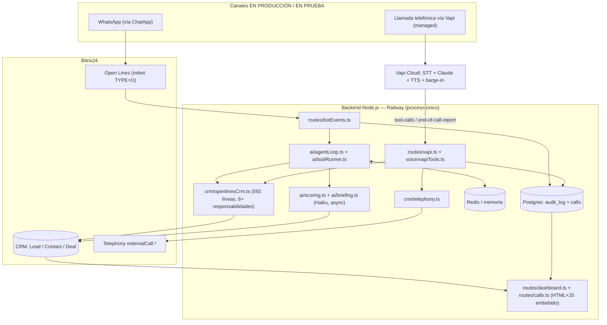
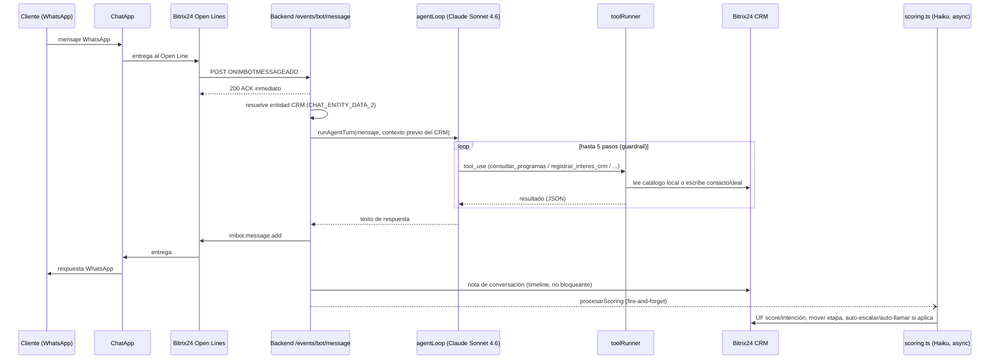
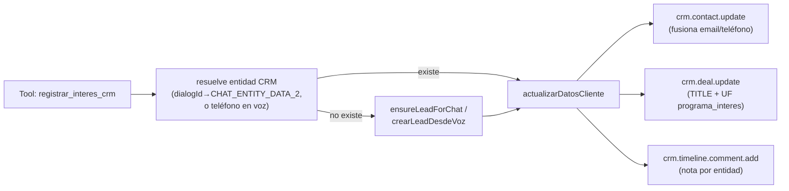
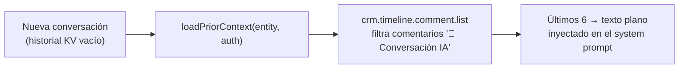
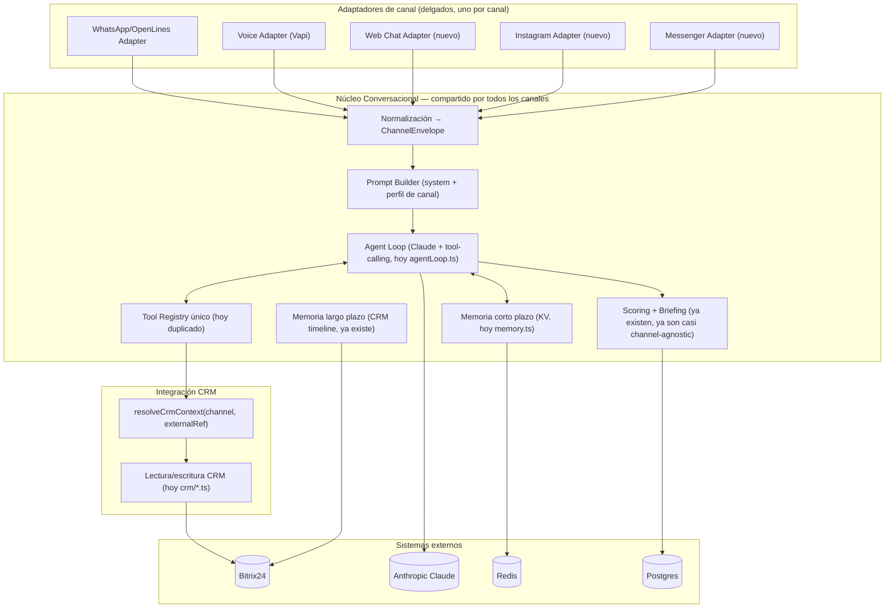
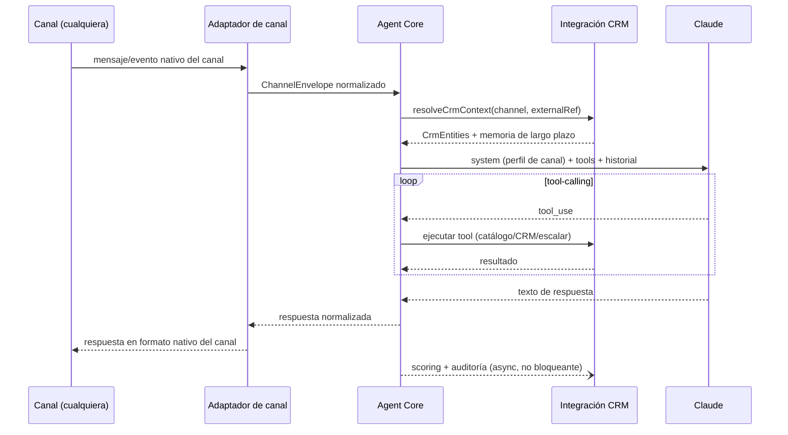
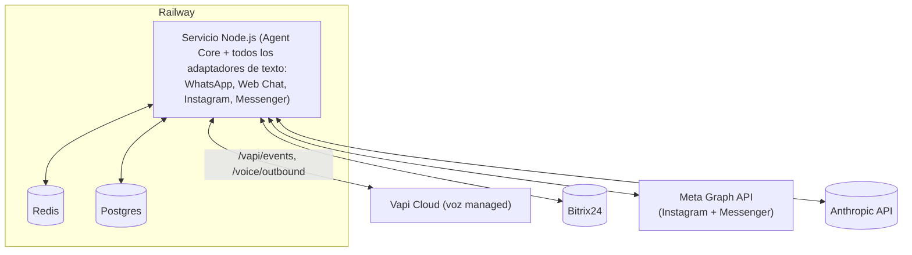

# Auditoría, Diagnóstico y Arquitectura Omnicanal — Agente Comercial UA Postgrados

> Documento de arquitectura. Autor: revisión técnica basada 100% en evidencia del repositorio `botbitrix24` (rama `main`, commit `f56fb78`, contrastada con la rama no fusionada `origin/hardening/security-resilience`, commit `ddd6e4d`). Toda afirmación cita archivo y línea; donde no hay evidencia se marca explícitamente como **[SUPUESTO]** o **[POR VALIDAR]**.

---

## 0. Corrección de contexto (léase antes que todo)

El encargo describe "un agente desarrollado en **Python** utilizando **Vapi**". La evidencia del repositorio dice algo distinto:

- El **agente que realmente está en producción** (chat de WhatsApp vía Open Lines, scoring, CRM, dashboards) es **100% Node.js + TypeScript**, corriendo como un único servicio Express en Railway (`src/index.ts`).
- El **canal de voz es Vapi** (servicio *managed* de terceros: STT+LLM+TTS en la nube de Vapi), también implementado en **TypeScript**: `src/routes/vapi.ts`, `src/voice/vapiTools.ts`, `src/voice/outbound.ts`. Nuestro backend solo recibe webhooks de Vapi y ejecuta tools; no hay código Python en el camino de voz.

> **Nota de alcance:** el repositorio incluía además un prototipo de voz self-hosted (**Pipecat**, Python, carpeta `voice-pipecat/`) como alternativa a Vapi. Durante esta auditoría se confirmó que esa vía **no se usará**, por lo que se retiró del repositorio (`voice-pipecat/` y `Fase2-Agente-de-Voz-Pipecat-Arquitectura.md`) y de este documento. La vía de voz queda consolidada 100% en Vapi.

En síntesis: no hay Python en el sistema. Este documento audita la arquitectura real — Node.js/TypeScript, con Vapi como único canal de voz.

---

## 1. Resumen Ejecutivo

El sistema actual es un **agente comercial conversacional funcional y ya en producción** para WhatsApp (vía Bitrix24 Open Lines/ChatApp), con integración real a Bitrix24 CRM (actualiza contacto/deal, mueve etapas, crea tareas, escala a humano), scoring de leads con IA, dos paneles de analítica embebidos en Bitrix24, y un **canal de voz vía Vapi** (TypeScript, semi-operativo — falta conectar cuentas reales de Twilio/Vapi para pruebas end-to-end).

Hallazgos centrales:

1. **La lógica de negocio SÍ está parcialmente compartida** (catálogo, detalle de programas, escritura en CRM), pero el **contrato de herramientas y el prompt del agente están duplicados** a mano en dos lugares (chat TS, Vapi TS) — el problema exacto que motiva ir a una arquitectura omnicanal.
2. El acoplamiento central es al **Bitrix Open Lines** (conceptos como `dialogId`, `chatId`, `botId` viven dentro del núcleo del agente, no en un adaptador), lo que impide reusar el "cerebro" tal cual para Web Chat, Instagram o Messenger sin tocar su interior.
3. Existe una **rama sin fusionar** (`origin/hardening/security-resilience`, 41 archivos, +1604/-723 líneas) que ya resuelve gran parte de lo que este informe iba a señalar como riesgo: verificación de firma de webhooks, fail-closed en secretos, cifrado de tokens OAuth en reposo, redacción de PII en logs, correlación de requests, descomposición del módulo-dios de CRM, y una primera suite de tests. **Fusionarla es la recomendación de mayor prioridad de este documento** (§9).
4. En el estado actual (`main`), el mayor riesgo de seguridad es real y concreto: **los webhooks de Bitrix (`/events/bot/*`, `/install`) no verifican el origen de la petición** — cualquiera en internet puede forjar un evento y hacer gastar tokens de Anthropic o manipular el flujo (§4).
5. El sistema **no usa RAG/vector DB**: la búsqueda de catálogo es determinística (normalización de acentos + tokenización + stopwords), una decisión deliberada y documentada para evitar que un RAG mezcle precios entre programas parecidos (`src/ai/catalog.ts:106-138`, `scripts/gen-kb.mts:5-7`). Esto es relevante para diseñar el "RAG" que pide la Fase 5: hay que decidir si de verdad conviene introducir uno.

La recomendación de fondo: **no reescribir**. Extraer un "Núcleo Conversacional" channel-agnostic a partir del código ya existente (agentLoop + tools + memoria + scoring, hoy acoplados a Bitrix Open Lines) y envolver cada canal en un adaptador delgado. El 70% del trabajo (catálogo, CRM, scoring, briefing, persistencia) ya está escrito de forma reutilizable; lo que falta es desacoplar el 30% restante (contexto del turno, prompt, tool registry) del vocabulario de Bitrix Open Lines.

---

## 2. Arquitectura Actual (Fase 1 — Auditoría del repositorio)

### 2.1 Stack y dependencias

| Capa | Tecnología | Evidencia |
|---|---|---|
| Runtime | Node.js ≥18, TypeScript (ESM, `"type":"module"`), ejecutado con `tsx` (sin paso de build/compilación en despliegue) | `package.json:1-32`, `railway.json:1-10` (`startCommand: npm start` → `tsx src/index.ts`) |
| Framework HTTP | Express 4, un único proceso, un único archivo de bootstrap | `src/index.ts` |
| LLM | Anthropic Claude — **Sonnet 4.6** como razonador principal, **Haiku 4.5** como clasificador barato (scoring, briefing) | `src/ai/client.ts:1-7`, `src/config.ts:42-43` |
| CRM | Bitrix24 REST, dos vías de auth: OAuth de app local (token del bot) + webhook entrante admin (para escrituras CRM, porque el token del bot es "no-Intranet" y tiene CRM limitado) | `src/bitrix/client.ts:98-106` |
| Canal chat | Bitrix24 Open Lines (`imbot` TYPE=O) recibiendo WhatsApp vía ChatApp | `src/bot/register.ts:11-41` |
| Canal voz | **Vapi** (managed: STT+LLM+TTS en la nube de Vapi), backend solo ejecuta tools y registra la llamada | `src/routes/vapi.ts`, `voice/vapi-assistant.json` |
| Persistencia KV | Redis (`ioredis`) si hay `REDIS_URL`; si no, `Map` en memoria de proceso — degradación transparente | `src/store/kv.ts:1-64` |
| Persistencia relacional | Postgres (`pg`) si hay `DATABASE_URL`; si no, auditoría solo en logs (no-op) | `src/store/db.ts:16-26` |
| Dependencias runtime | `@anthropic-ai/sdk`, `bottleneck`, `dotenv`, `express`, `ioredis`, `pg` — **6 dependencias**, sin frameworks pesados | `package.json:14-21` |
| Despliegue | Railway, un solo servicio, Nixpacks, healthcheck `/health`, sin Dockerfile, **sin pipeline de CI** (no existe `.github/workflows`, verificado) | `railway.json`, búsqueda de `.github/**` sin resultados |

**Nota sobre "compilación":** no hay paso de `tsc` en el arranque; el código TypeScript se ejecuta directo vía `tsx`. `npm run typecheck` existe pero nada lo invoca automáticamente antes de desplegar — un error de tipos puede llegar a producción sin que nada lo bloquee.

### 2.2 Mapa de componentes (estado actual)



### 2.3 Módulos y responsabilidades (con evidencia línea a línea)

| Módulo | Responsabilidad real observada | Evidencia |
|---|---|---|
| `src/index.ts` | Bootstrap Express monolítico: registra **22 rutas** distintas (chat, voz Vapi, dashboards, setup admin, health/debug), inicializa Postgres y el scheduler de sync de llamadas. Sin capas controller/service separadas. | `src/index.ts:1-126` |
| `src/config.ts` | Único objeto de configuración; parsea **todas** las env vars de forma eager al importar el módulo. Sin validación de esquema: un `BITRIX_STAGE_MAP` mal formado se traga en un `try/catch` vacío y cae a `{}` sin avisar. | `src/config.ts:5-23` (`parseStageMap`, `parseSimpleStageMap`) |
| `src/ai/agentLoop.ts` | El "cerebro" del canal chat: loop de tool-calling con Claude, `MAX_STEPS=5` como guardrail anti-bucle, prompt fijo + contexto CRM previo inyectado como texto. **Acoplado a `AgentCtx`** (`dialogId`, `chatId`, `botId` — conceptos de Bitrix Open Lines). | `src/ai/agentLoop.ts:1-73`, tipo `AgentCtx` en `src/ai/toolRunner.ts:11-18` |
| `src/ai/tools.ts` + `toolRunner.ts` | 5 tools para el canal chat (`consultar_programas`, `detalle_programa`, `registrar_interes_crm`, `solicitar_llamada`, `escalar_a_humano`), despachadas por un `switch` acoplado al mismo `AgentCtx` de Bitrix. | `src/ai/tools.ts:1-111`, `src/ai/toolRunner.ts:20-122` |
| `src/voice/vapiTools.ts` | **Reimplementación paralela** de 4 de esas 5 tools para el canal de voz Vapi, con firma y forma de retorno distintas (`runVapiTool`, contexto `VoiceCallCtx` por `callId`, no por `dialogId`). | `src/voice/vapiTools.ts:86-141` |
| `src/ai/memory.ts` | Memoria de corto plazo: últimos 24 turnos por `dialogId` en KV, TTL 6h. | `src/ai/memory.ts:1-19` |
| `src/crm/openlinesCrm.ts` | **Módulo-dios** (592 líneas): resolución de entidad CRM desde el evento, fusión de multicampos (teléfono/email) sin perder datos existentes, escritura de contacto/deal/lead, búsqueda CRM por teléfono para voz, resolución de responsable/observadores del deal, y acciones de "lead caliente" (UF + mover etapa + crear tarea con plazo). Confirmado por el propio equipo: existe un commit (`337615b`, rama sin fusionar) titulado *"descompone openlinesCrm.ts (modulo-dios)"*. | `src/crm/openlinesCrm.ts:1-592` |
| `src/crm/telephony.ts` | Único módulo realmente enfocado y con una sola responsabilidad: `telephony.externalCall.*`, documentando explícitamente que estos métodos requieren token de aplicación OAuth (no webhook). | `src/crm/telephony.ts:1-109` |
| `src/crm/callStats.ts` + `callSync.ts` + `store/db.ts` (tabla `calls`) | ETL bien diseñado: sincronización incremental por marca de agua (con solape de 1 min), backfill inicial configurable, upsert por id, KPIs exactos vía SQL agregando sobre Postgres vs. modo "en vivo" (REST, muestra acotada con aviso en la UI). | `src/crm/callSync.ts:1-69`, `src/store/db.ts:159-250` |
| `src/obs/metrics.ts` + `obs/audit.ts` | Contadores y latencias **en memoria de proceso** (se pierden en cada redeploy/restart de Railway; no se agregan si hubiera >1 réplica). `audit()` además persiste en `audit_log` (Postgres, columna `detail JSONB`) — esa tabla JSONB termina siendo la fuente de TODO el dashboard de negocio (`dbMetricsSummary`), vía queries ad-hoc sobre JSON (`detail->>'score'`, `detail->'input'->>'programa_interes'`, etc.), es decir, "schema on read" sin un modelo relacional propio. | `src/obs/metrics.ts:1-36`, `src/store/db.ts:261-336` |
| `src/routes/dashboard.ts`, `routes/calls.ts` | Dos paneles embebidos en Bitrix24 vía `placement.bind`, servidos como **strings HTML+CSS+JS de ~250 líneas cada uno**, directamente en el archivo de rutas. Sin build de frontend, sin tipos, sin tests. | `src/routes/dashboard.ts:58-252`, `src/routes/calls.ts:46-231` |
| `src/store.ts` | Estado global de la app (`auth` + `botId`) bajo una única clave KV (`app:state`) — **diseño single-tenant**: un solo portal Bitrix por despliegue. | `src/store.ts:12-33` |
| `src/bitrix/client.ts` | `Bottleneck` (leaky bucket 2 req/s, ráfaga 50, 2 concurrentes) como **limitador global de proceso**, compartido por todas las llamadas a Bitrix de todos los canales/diálogos a la vez. Refresco de token on-demand ante `expired_token`/`invalid_token`, un solo reintento. | `src/bitrix/client.ts:6-12, 49-59` |

### 2.4 Gestión de estado y contexto

- **Corto plazo (conversación):** KV por `dialogId` (chat) o por `callId` (voz) — **dos mecanismos de sesión paralelos y no unificados** (`src/session.ts:1-35` vs. `src/voice/vapiTools.ts:17-38`).
- **Largo plazo (entre sesiones):** no hay base vectorial ni resumen persistente propio; se reutiliza el **timeline de comentarios del CRM** como memoria — un hack de bajo costo, efectivo, pero acoplado 100% a la API de comentarios de Bitrix (`src/crm/openlinesCrm.ts:102-125`, función `loadPriorContext`).
- **Reglas de negocio** (umbrales de score, mapa etapa↔embudo, minutos de tarea) viven **solo en variables de entorno de Railway**, sin UI ni versionado (`src/config.ts:61-99`). Cambiarlas exige editar infraestructura y redeployar.

### 2.5 Autenticación

- OAuth 2.0 de app local de Bitrix24: `access_token`/`refresh_token` extraídos de cada evento entrante (`src/bitrix/auth.ts:9-35`), persistidos globalmente (no por-portal), refrescados on-demand (`src/bitrix/refresh.ts`).
- Para **escrituras CRM** se prioriza un webhook entrante admin (`BITRIX_WEBHOOK_URL`) en vez del token del bot, porque el token del bot es "no-Intranet" con CRM limitado (`src/bitrix/client.ts:98-106`) — funciona, pero es una superficie de permisos amplia (webhook con acceso completo) usada como atajo.
- **Voz (Vapi):** secreto compartido `VAPI_SECRET` vía header `x-vapi-secret` — **en `main`, si el secreto no está configurado, el middleware deja pasar la petición sin autenticar** (`src/routes/vapi.ts:15-19`).
- **Webhooks de Bitrix (`/events/bot/*`, `/install`): sin verificación de origen alguna en `main`** — se acepta cualquier `auth` que venga en el body (`src/bitrix/auth.ts:9-35`) sin comparar contra un `application_token` ni firma. Ver §4.1 para el impacto.

### 2.6 Manejo de errores, logging y observabilidad

- Logger propio (`src/log.ts:1-14`): una línea de texto plano por evento, sin niveles configurables ni structured-logging real, pensado para que Railway no colapse el JSON.
- Patrón consistente: **ACK inmediato + procesamiento asíncrono** en el webhook del bot (`res.status(200)` antes de procesar) para no bloquear a Bitrix ni arriesgar timeouts/reintentos (`src/routes/botEvents.ts:25-30`).
- Idempotencia: `once(key, ttl)` sobre KV para descartar eventos duplicados por `MESSAGE_ID` (`src/store/kv.ts:106-111`, uso en `src/routes/botEvents.ts:54-57`).
- Casi toda llamada a Bitrix está envuelta en `try/catch` con `log.warn` y continúa (resiliencia por sobre estrictez) — bien para robustez ante una API de terceros inestable, pero también oculta fallos silenciosos si nadie revisa logs.
- **Sin tests** en `main` (no existe carpeta `test/` ni script `test` en `package.json`). Sí existen en la rama `hardening/security-resilience` (`test/pure.test.ts`, 91 líneas, usando el test runner nativo de Node — cero dependencias nuevas).

---

## 3. Diagnóstico Técnico (Fase 2 — mapa funcional, y Fase 3 — auditoría de escalabilidad)

### 3.1 Cómo responde el agente hoy (flujo real, canal chat)



Puntos clave de este flujo (evidencia): el catálogo **nunca lo inventa el LLM** — el prompt lo obliga explícitamente a usar `consultar_programas`/`detalle_programa` y a decir "no lo sé" si la tool no trae dato (`src/ai/prompt.ts:5,14`). Los datos de contacto se capturan de forma incremental, un dato a la vez, y se funden (no se sobreescriben) con lo ya existente en el CRM (`src/crm/openlinesCrm.ts:159-167`, `mergeMultifield`).

### 3.2 Cómo decide acciones y usa herramientas

El agente **no tiene un planificador separado**: es un único loop de tool-calling de Claude (patrón ReAct implícito de la Messages API), sin razonamiento intermedio expuesto, sin router de intents previo. El "system prompt" (`src/ai/prompt.ts`) concentra: personalidad, orden de objetivos, reglas de qué NO inventar, y hasta el guion exacto de captura de datos ("pide nombre, luego correo, luego teléfono, uno a la vez"). Es efectivo pero **es una sola cadena de texto de ~20 líneas que hace de máquina de estados implícita** — cualquier cambio de flujo comercial exige editar prosa y confiar en que el LLM la siga, sin tests que lo verifiquen.

### 3.3 Cómo modifica Bitrix24



Las "acciones de lead caliente" (`accionInteresVoz`, `src/crm/openlinesCrm.ts:506-575`) van más allá de escribir campos: mueven la etapa del deal según un mapa por embudo y **crean una tarea al asesor responsable con un plazo (`DEADLINE`) de 15 minutos por defecto** — esto ya es, de facto, un motor de automatización de seguimiento comercial embebido en una función, no una feature declarada como tal.

### 3.4 Cómo agenda acciones (voz saliente)

Dos disparadores de llamada saliente automática, ambos vía Vapi (`src/voice/outbound.ts`):
1. El propio cliente lo pide en el chat (tool `solicitar_llamada`).
2. El scoring detecta un score ≥ `SCORE_LLAMAR` y llama automáticamente si hay teléfono en el CRM (`src/ai/scoring.ts:141-169`), con flag `autoCalled` para no duplicar.

### 3.5 Cómo mantiene contexto entre sesiones



Elegante por su simplicidad (sin infraestructura de vectores), pero **frágil**: depende de que el formato del comentario (`"🤖 Conversación IA"`) no cambie, y no escala bien si el volumen de comentarios por entidad crece mucho (trae y filtra client-side, sin índice).

### 3.6 Auditoría de escalabilidad — puntuación con evidencia

| Dimensión | Puntaje (1-10) | Justificación (evidencia) |
|---|:-:|---|
| **Modularidad** | 5 | Buena separación por carpeta (`ai/`, `crm/`, `bitrix/`, `store/`, `routes/`) pero el contrato de *tools* + prompt + loop de razonamiento está duplicado entre canales (§2.3). La rama `hardening` mejora la cohesión interna de CRM pero no resuelve la duplicación entre canales. |
| **Mantenibilidad** | 4 | Dashboards como strings HTML embebidos (~250 líneas c/u, sin tests ni tipos); reglas de negocio en env vars sin validación de esquema (`parseStageMap` traga errores en silencio); sin CI. Sube a ~6 si se fusiona `hardening` (tests + tipos de respuesta Bitrix). |
| **Reutilización** | 6 | Catálogo, detalle de programa, y buena parte de CRM (`openlinesCrm.ts`) **sí** se reusan entre chat y voz Vapi (`src/voice/vapiTools.ts` importa directo de `ai/catalog.ts`/`ai/detalles.ts`/`crm/openlinesCrm.ts`). Lo que NO se reusa es el loop de razonamiento y el prompt (cada canal tiene el suyo). |
| **Separación de responsabilidades** | 5 | `telephony.ts` y `callStats/callSync` están ejemplarmente enfocados (una responsabilidad c/u). `openlinesCrm.ts` es un módulo-dios de 592 líneas con 6+ responsabilidades — reconocido y ya en proceso de descomposición en la rama `hardening` (`chat.ts`, `crmWrite.ts`, `directory.ts`, `entities.ts`, `voiceActions.ts`). |
| **Dependencias** | 9 | Solo 6 dependencias runtime, todas justificadas y de bajo riesgo (`package.json:14-21`); sin frameworks pesados, sin ORM. Una fortaleza real del proyecto. |
| **Acoplamiento** | 3 | El hallazgo más importante: `AgentCtx` (núcleo del agente) tiene campos `dialogId`/`chatId`/`botId` — vocabulario de Bitrix Open Lines **dentro del cerebro del agente**, no en un adaptador (`src/ai/toolRunner.ts:11-18`). Esto es exactamente lo que hay que resolver para que Fase 4 (omnicanal) sea limpia. |
| **Escalabilidad horizontal** | 4 | Métricas, rate-limiter y caché de sesión en memoria de proceso (documentado explícitamente como "per-proceso" en la propia rama `hardening`, `src/util/concurrency.ts` comentario de cabecera). Un solo proceso Railway hoy: suficiente para el volumen actual, pero no soporta >1 réplica sin mover ese estado a Redis. |
| **Resiliencia** | 7 | Degradación con gracia si falta Redis/Postgres (memoria/no-op), ACK-then-process-async, idempotencia por `MESSAGE_ID`, refresco de OAuth con 1 reintento, casi toda llamada a Bitrix con try/catch + warn. Fortaleza real. |
| **Rendimiento** | 7 | Throttle Bottleneck protege el rate-limit de Bitrix; escrituras CRM no bloqueantes en la ruta de voz (explícitamente documentado "para que la voz siga fluida", `src/voice/vapiTools.ts:115-119`); latencia LLM medida (p95). |
| **Seguridad** | 3 | Webhooks de Bitrix sin verificación de origen; secretos de voz fail-open si faltan; tokens OAuth en texto plano en Redis; PII sin redactar en logs/auditoría. **Todo esto ya tiene solución escrita en la rama `hardening`, sin fusionar.** Subiría a ~7 al fusionarla. |

**Promedio actual (`main`): ~5.3/10.** Es el perfil típico y razonable de un PoC que evolucionó rápido hacia producción real: las decisiones de resiliencia y bajo acoplamiento de dependencias son sólidas; lo que falta es exactamente lo que ya hay una rama tratando de arreglar (seguridad/mantenibilidad) más el trabajo nuevo que pide este encargo (desacoplar de Bitrix Open Lines para ser omnicanal).

---

## 4. Riesgos

| # | Riesgo | Evidencia | Estado |
|---|---|---|---|
| 1 | **Webhooks de Bitrix sin verificación de origen** (`/events/bot/*`, `/install`): cualquier cliente en internet puede forjar un evento `ONIMBOTMESSAGEADD` con un `auth.access_token`/`domain` propio y hacer que el backend ejecute el agente completo (gasto de Anthropic, posible manipulación) | `src/bitrix/auth.ts:9-35` no valida procedencia | 🔴 Abierto en `main`; **ya resuelto** en `hardening` (`src/bitrix/verifyEvent.ts`) |
| 2 | **Fail-open en el secreto de voz**: si `VAPI_SECRET` no está seteado, `/vapi/events` queda sin autenticación | `src/routes/vapi.ts:15-19` | 🔴 Abierto en `main`; **ya resuelto** en `hardening` (fail-closed en producción, `src/routes/verifySecret.ts`) |
| 3 | **Tokens OAuth de Bitrix en texto plano** en Redis (KV) | `src/store.ts` guarda `Auth` sin cifrar | 🔴 Abierto en `main`; **mitigado** en `hardening` (`src/store/tokenCrypto.ts`, AES-256-GCM, degrada a texto plano si falta `TOKEN_ENC_KEY`) |
| 4 | **Diseño single-tenant**: un solo portal Bitrix por despliegue (`app:state` global) | `src/store.ts:12-33` | Abierto — bloqueante si se quiere multi-marca/multi-portal |
| 5 | **Duplicación del contrato de herramientas** (chat TS / Vapi TS): riesgo de divergencia silenciosa al cambiar una tool y olvidar el otro canal | `src/ai/tools.ts`, `src/voice/vapiTools.ts`, `voice/vapi-assistant.json` | Abierto — es el problema de fondo de la Fase 4 |
| 6 | **Reglas de negocio solo en env vars**, sin UI ni versionado, con parseo que traga errores en silencio | `src/config.ts:5-23` | Abierto |
| 7 | **Métricas y rate-limiter en memoria de proceso**: se pierden en cada redeploy y no se agregan si hay >1 réplica | `src/obs/metrics.ts`, `src/util/concurrency.ts` (rama hardening) | Abierto (aceptable a la escala actual) |
| 8 | **Sin pipeline de CI**: nada ejecuta `typecheck`/`test` automáticamente antes de desplegar | Verificado: no existe `.github/workflows` | Abierto |
| 9 | **Dependencia de un solo proveedor LLM** (Anthropic), sin capa de abstracción de modelo | `src/ai/client.ts` | Bajo hoy; relevante si se evalúa multi-modelo a futuro |
| 10 | **PII sin redactar** en logs y en `audit_log` (nombre, email, teléfono viajan en claro en `detail JSONB`) | `src/obs/audit.ts` en `main` | 🔴 Abierto en `main`; **resuelto** en `hardening` (`src/obs/redact.ts`) |

---

## 5. Oportunidades de Mejora (Quick Wins técnicos, previos a lo omnicanal)

1. **Fusionar `origin/hardening/security-resilience`** — resuelve 5 de los 10 riesgos de la tabla anterior sin escribir código nuevo, solo revisando y mergeando lo que ya existe.
2. Agregar `.github/workflows/ci.yml` que corra `npm run typecheck` y `npm test` en cada PR (la rama hardening ya deja el `test` script listo).
3. Sustituir el `try/catch` silencioso de `parseStageMap`/`parseSimpleStageMap`/`parseFunnelLabels` (`src/config.ts`) por un log de error explícito al bootear si el JSON es inválido — hoy un typo en Railway se traduce en "el bot dejó de mover etapas" sin ningún rastro.
4. Extraer los dashboards (`dashboard.ts`, `calls.ts`) de strings inline a archivos `.html`/`.js` estáticos servidos por Express — mejora testeable/mantenible sin tocar la lógica.
5. Unificar los dos mecanismos de sesión (`session.ts` por `dialogId` vs. `VoiceCallCtx` por `callId`) bajo una interfaz común de "contexto de conversación", como paso previo natural a la Fase 4.

---

## 6. Arquitectura Omnicanal Propuesta (Fase 4)

### 6.1 Principio de diseño

Extraer un **Núcleo Conversacional** (Agent Core) channel-agnostic a partir de lo que YA existe (`agentLoop.ts` + `tools.ts`/`toolRunner.ts` + `memory.ts` + `scoring.ts`/`briefing.ts`), reemplazando el tipo `AgentCtx` (hoy con `dialogId`/`chatId`/`botId` de Bitrix Open Lines) por un contrato neutro:

```ts
type ChannelEnvelope = {
  channel: 'whatsapp' | 'voice_vapi' | 'webchat' | 'instagram' | 'messenger';
  conversationId: string;      // reemplaza dialogId/callId
  externalUserRef: string;     // teléfono, PSID, chat id externo, etc.
  text: string;
  crmContext?: CrmEntities;    // ya resuelto por el adaptador o por el Core
};
```

Cada canal se implementa como un **adaptador delgado**: traduce su formato nativo (payload de Bitrix, mensaje de Vapi, evento de Meta, WebSocket de audio) a `ChannelEnvelope` y de vuelta a su formato de salida. El Core no sabe qué canal lo invocó.

**Sobre la voz — matiz importante:** el audio en tiempo real (STT/TTS/barge-in) tiene restricciones de latencia que el `agentLoop.ts` actual no fue diseñado para cumplir dentro de un pipeline de streaming. Por eso Vapi **debe seguir resolviendo el audio él mismo** (eso ya es correcto en el diseño actual: "solo viaja texto/JSON" entre Vapi y el backend, `Fase2-Agente-de-Voz-Vapi-Arquitectura.md:70`). Lo que SÍ hay que unificar es el **contrato de herramientas y el prompt de negocio**, generándolos desde una única fuente de verdad en vez de copiarlos a mano dos veces.

### 6.2 Diagrama de componentes (arquitectura objetivo)



### 6.3 Diagrama de secuencia (flujo genérico, cualquier canal)



### 6.4 Diagrama de despliegue



### 6.5 Perfil por canal (lo único que cambia entre canales)

| Canal | Longitud de respuesta | Tono/formato | Capacidades específicas |
|---|---|---|---|
| WhatsApp (chat) | 2-5 frases (ya definido en el prompt actual) | Cercano, markdown ligero permitido | Ofrecer llamada de voz, adjuntar link si se pide |
| Voz (Vapi) | 1-2 frases, sin URLs ni listas (ya definido en `voice/vapi-assistant.json`) | Cálido, sin jerga | Transferencia en vivo a asesor (`transferCall`) |
| Web Chat (nuevo) | Más largo permitido (hasta párrafos), markdown completo | Profesional, puede incluir links/imágenes de programas | Botones/quick-replies, formulario de cotización embebido |
| Instagram / Messenger (nuevo) | Similar a WhatsApp, 2-4 frases | Casual, emojis permitidos | Igual a WhatsApp: reutiliza el mismo Core casi sin cambios (es texto) |

Esto se implementa como un objeto `ChannelProfile` que el **Prompt Builder** mezcla con el prompt de negocio compartido (hoy `SYSTEM_PROMPT` fijo) — el prompt de negocio (qué vender, qué no inventar, cómo capturar datos) es idéntico en todos los canales; solo cambia el envoltorio de estilo.

---

## 7. Evolución hacia un Agente Comercial Completo (Fase 5)

| Capacidad | Estado actual | Beneficio | Prioridad | Dependencias | Complejidad | Impacto en arquitectura |
|---|---|---|:-:|---|:-:|---|
| **Captar leads** | ✅ Ya existe (`registrar_interes_crm`) | — | — | — | — | Ninguno; ya vive en el Core candidato |
| **Calificar prospectos (scoring)** | ✅ Ya existe (`ai/scoring.ts`, Haiku) | — | — | — | — | Ya es prácticamente channel-agnostic (opera sobre historial + `CrmEntities`) |
| **Actualizar Bitrix24** | ✅ Ya existe | — | — | — | — | — |
| **Asignar asesores** | ✅ Ya existe parcialmente (`getDealAsesores`, responsable del deal) | — | — | — | — | Falta reglas de reparto explícitas si se quiere balancear carga |
| **Escalar a humano** | ✅ Ya existe (`escalar_a_humano` + auto-escalación por score) | — | — | — | — | — |
| **Responder con RAG** | ❌ No existe (deliberadamente: búsqueda determinística) | Bajo si el catálogo sigue siendo acotado y curado; el riesgo de un RAG es mezclar precios, ya evitado hoy | Baja | Vectorizar `voice/base-conocimiento-programas.md` (ya generado) | Media | Solo si el catálogo crece mucho o se necesita responder sobre contenido no estructurado (mallas completas, reglamentos); mantener el lookup exacto como fallback obligatorio para precios |
| **Recomendar programas** | Parcial (`consultar_programas` filtra, no rankea por afinidad) | Medio-alto: sube conversión al guiar mejor la decisión | Media | Historial de conversación + scoring existente | Baja-media | Nueva tool `recomendar_programas` sobre el mismo catálogo, sin tocar el Core |
| **Generar cotizaciones** | ❌ No existe | Alto: acelera decisión de compra | Media-alta | Datos de arancel/matrícula ya existentes en `detalles.data.json` | Media | Nueva tool + posible generación de PDF/link; requiere plantilla de cotización |
| **Resolver objeciones** | Parcial (vive implícito en el prompt) | Medio | Baja | Ninguna nueva | Baja | Enriquecer el prompt de negocio con objeciones frecuentes (dato de negocio, no arquitectura) |
| **Agendar reuniones** | ❌ No existe | Alto: reduce fricción de handoff a asesor | Alta | Integración con Bitrix Calendar o Google Calendar | Media | Nueva tool `agendar_reunion` + nuevo adaptador de calendario |
| **Automatizar seguimientos** | Parcial (tarea con `DEADLINE` de 15 min en `accionInteresVoz`) | Alto: recupera leads que se enfrían | Media | Scheduler (ya existe patrón en `callSync.ts`) | Media | Nuevo job periódico + reglas de cadencia (no bloquea el Core) |
| **Recuperar clientes inactivos** | ❌ No existe | Alto: reactiva pipeline | Media | Scoring histórico + outbound (WhatsApp template o llamada Vapi) | Media-alta | Requiere plantillas de mensaje proactivo (WhatsApp Business API exige plantillas aprobadas) |
| **Pagos online** | ❌ No existe | Medio (depende del modelo comercial de matrícula) | Baja | Pasarela de pago (Webpay/Transbank, Chile) | Alta | Nuevo adaptador de pagos + consideraciones de seguridad/PCI; probablemente fuera del Core, como servicio aparte |
| **Detectar intención de compra** | Parcial (scoring ya clasifica intención alta/media/baja) | — | — | — | — | Ya cubierto; se puede afinar el prompt del clasificador |

---

## 8. Plan de Migración (Fase 6 — Roadmap incremental, sin downtime)

Principio: cada etapa deja el sistema **desplegable y funcionando** en `main`; nada rompe WhatsApp/voz en producción mientras se avanza.

| Etapa | Objetivo | Cambios | Archivos afectados | Riesgos | Pruebas necesarias | Tiempo estimado | Compatibilidad hacia atrás |
|---|---|---|---|---|---|---|---|
| **0. Fusionar hardening** | Cerrar los 5 riesgos de seguridad ya resueltos en la rama | Merge de `origin/hardening/security-resilience` a `main`, definir `TOKEN_ENC_KEY`/`BITRIX_APPLICATION_TOKEN`/`DASHBOARD_TOKEN`/`ADMIN_TOKEN` en Railway | 41 archivos (ya escritos, solo revisar y mergear) | Bajo: cambios ya probados en su propia rama; validar que `NODE_ENV=production` esté seteado en Railway (el fail-closed depende de eso) | `npm test`, `npm run typecheck`, smoke test manual de `/install` y un mensaje de WhatsApp real | 2-3 días (revisión + variables + deploy) | Total: fail-open solo en dev, sin romper producción si las env vars se configuran antes del deploy |
| **1. Añadir CI** | Bloquear regresiones antes de merge | `.github/workflows/ci.yml` (typecheck + test) | Nuevo archivo | Ninguno | El propio pipeline | 0.5 día | Total |
| **2. Unificar sesión/contexto** | Un solo tipo de "contexto de conversación" para chat y voz | Reemplazar `session.ts` + `VoiceCallCtx` por una interfaz común | `src/session.ts`, `src/voice/vapiTools.ts` | Medio: tocar el estado de conversaciones en curso; desplegar en ventana de bajo tráfico | Tests unitarios del nuevo módulo + prueba manual de una conversación de WhatsApp y una llamada Vapi | 3-5 días | Total (interfaz interna, sin cambio de API externa) |
| **3. Extraer el Núcleo Conversacional** | Desacoplar `agentLoop`+`tools`+`toolRunner` de `AgentCtx` (Bitrix-específico) hacia `ChannelEnvelope` | Refactor de `src/ai/agentLoop.ts`, `src/ai/toolRunner.ts`; el adaptador de WhatsApp (`botEvents.ts`) pasa a traducir su payload al nuevo contrato | `src/ai/*`, `src/routes/botEvents.ts` | Medio-alto: es el corazón del sistema; riesgo de regresión en producción | Suite de tests del Core (mockeando el LLM) + réplica del flujo de aceptación de `docs/ACCEPTANCE.md` en staging | 1-2 semanas | Total: mismo comportamiento observable en WhatsApp; requiere feature-flag o branch por rama antes de mergear |
| **4. Canal Web Chat (primer canal nuevo, valida el Core)** | Probar la abstracción con el canal más simple (sin restricciones de latencia de audio ni políticas de Meta) | Nuevo adaptador HTTP/WebSocket + UI de chat embebible | Nuevo `src/channels/webchat/*` | Bajo: canal aislado, no toca WhatsApp/voz existentes | Tests end-to-end del adaptador + prueba manual en navegador | 1-2 semanas | Total (canal aditivo) |
| **5. Unificar el contrato de herramientas entre chat y voz** | Generar el JSON de tools de Vapi desde `src/ai/tools.ts` (fuente única) en vez de mantenerlo copiado a mano en `voice/vapi-assistant.json` | Script de generación (similar a `scripts/gen-kb.mts`) que emite `voice/vapi-assistant.tools.json` | `scripts/`, `voice/vapi-assistant.json` | Bajo: no cambia comportamiento, solo la fuente de verdad | Diff manual del schema generado vs. el actual antes de reemplazar | 2-3 días | Total |
| **6. Canales Instagram y Messenger** | Reusar el Core (son texto, igual que WhatsApp) | Adaptadores Meta Graph API (webhook verify + Send API) | Nuevo `src/channels/meta/*` | Medio: requiere app review de Meta, políticas de mensajería (ventanas de 24h) | Tests del adaptador + pruebas con cuentas de prueba de Meta | 2-3 semanas (incluye tiempo de aprobación de Meta) | Total (aditivo) |
| **7. Capacidades comerciales priorizadas** (recomendaciones, cotizaciones, agendamiento, nurture) | Sumar valor comercial sobre el Core ya unificado | Nuevas tools + integraciones puntuales (calendario, plantillas WhatsApp) | `src/ai/tools.ts` (una vez sea la fuente única), nuevos módulos de integración | Bajo-medio, aditivo por diseño de tools | Tests por tool + validación de negocio con el equipo comercial | Variable por capacidad (ver tabla §7) | Total (aditivo) |

---

## 9. Priorización de Mejoras

**Quick Wins (días, bajo riesgo, alto impacto inmediato):**
- Fusionar `origin/hardening/security-resilience` (cierra 5 riesgos de seguridad ya resueltos).
- Agregar CI (`typecheck` + `test` en cada PR).
- Loggear (no silenciar) errores de parseo de configuración (`parseStageMap` y afines).
- Extraer dashboards de strings inline a archivos estáticos.

**Mediano Plazo (semanas, valor estructural):**
- Unificar sesión/contexto de conversación (chat + voz).
- Extraer el Núcleo Conversacional channel-agnostic (Etapa 3 del roadmap) — es el prerrequisito real de todo lo omnicanal.
- Lanzar Web Chat como primer canal nuevo, para validar la abstracción con riesgo acotado.
- Unificar el contrato de herramientas entre chat y voz (los dos lugares donde hoy vive duplicado).
- Recomendación de programas y cotizaciones (alto impacto comercial, baja-media complejidad).

**Largo Plazo (uno o más trimestres):**
- Instagram y Messenger (sujeto a tiempos de aprobación de Meta).
- Automatización de seguimientos y recuperación de inactivos (requiere plantillas de mensajería aprobadas y un scheduler de cadencias).
- Pagos online (mayor complejidad regulatoria/seguridad; evaluar si corresponde al alcance de este agente o a un sistema aparte).
- Reevaluar RAG solo si el catálogo crece a un tamaño donde el lookup exacto deje de ser suficiente.

---

## 10. Recomendaciones Finales

1. **No reescribir.** El 70% de la lógica de negocio (catálogo, CRM, scoring, briefing, persistencia, resiliencia) ya está bien construido y es reutilizable tal cual. El trabajo real de "ir a omnicanal" es desacoplar el 30% restante (contexto de turno, prompt, tool registry) del vocabulario de Bitrix Open Lines.
2. **Fusionar primero, diseñar después.** Antes de escribir una sola línea de la arquitectura omnicanal, cerrar la rama `hardening/security-resilience` — es trabajo ya hecho, ya revisado, y resuelve exactamente los riesgos de seguridad que de otro modo este documento tendría que marcar como bloqueantes.
3. **Validar la abstracción con el canal más simple primero** (Web Chat), no con el más vistoso (voz) ni el más regulado (Meta). Si el Core no queda limpio para Web Chat, tampoco quedará limpio para los demás.
4. **Tratar el contrato de herramientas como un artefacto generado, no escrito a mano dos veces.** Es la causa raíz más probable de bugs de "un canal responde distinto a otro" a futuro — más simple ahora que la voz quedó consolidada en un solo proveedor (Vapi).
5. **Mantener el lookup exacto de catálogo como línea roja.** La decisión actual de evitar RAG para precios/datos duros está bien fundamentada (evita alucinaciones de precio) y no debería revertirse solo porque la Fase 5 menciona "RAG" — úsese RAG, si acaso, para contenido no estructurado adicional, nunca para reemplazar el lookup exacto de aranceles.
